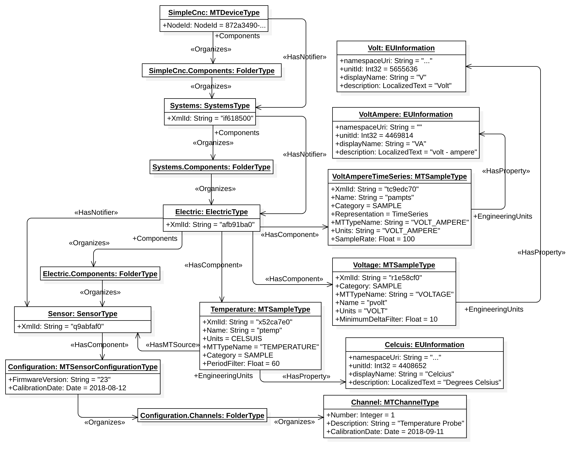
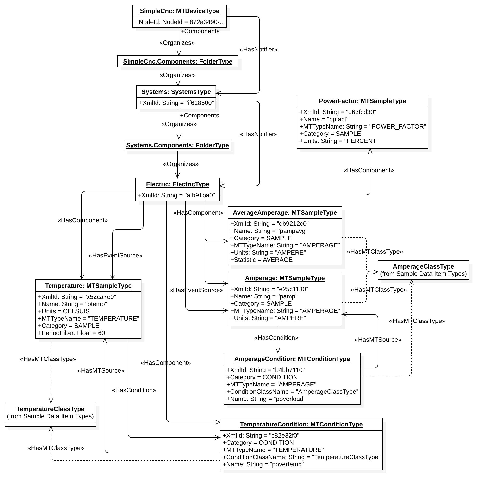
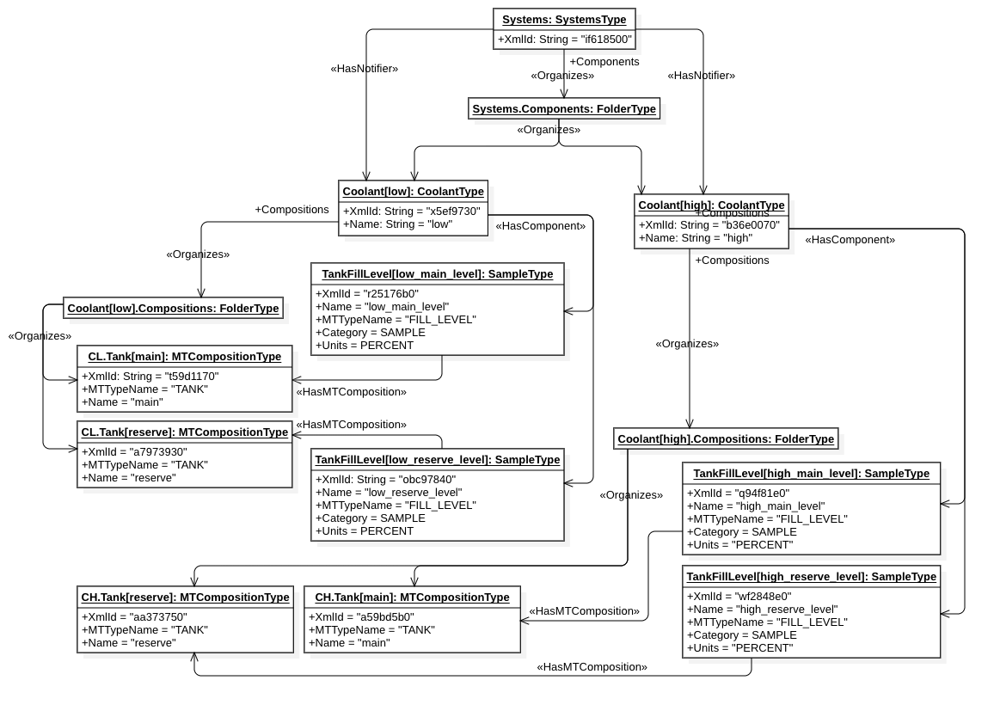

{{latex(\clearpage)}}

# Mapping the MTConnect Information Model to OPC UA  {#mtconnect-mapping}

This section describes a {{term(uml)}} representation of MTConnect semantic data models for mapping MTConnect into {{term(opc)}} {{term(ua)}}. More detailed information is provided in Section {{ref(mtconnect_information_model)}} for each data type.

OPC UA defines abstractions representing data, relationships, and events from devices. The abstractions do not provide the semantic meaning; they provide a structure to convey the meta-data and the values as they change. The OPC UA model has the base building blocks to represent an ontological model where the specific ontology is povided by companion specification for a specific domain.

MTConnect has similar capabilities but uses a different structural model where the meta-data and the streaming values are in separate documents to normalize the data flow in a similar way that many publish-subscribe protocols separate the structure from the data. MTConnect also supports a store-and-forward capability like many message brokers in a {{term(mom)}} architecture to enable resilience and recovery of data in the event of connectivity problems.

When translating from MTConnect to {{term(opc)}} {{term(ua)}}, the MTConnect abstractions of {{termplural(MTDataItem)}} are converted using the OPC UA  {{term(DataVariable)}} abstractions as given in {{cite(UAPart8)}}.  The relationships are mapped to multiple {{term(DataVariable)}} types where the category and the type determine the correct mapping. Conditions are mapped a sub-type of the OPC UA {{uamodel(BaseObjectType)}} representing the meta-data associated with the MTConnect {{term(MTCondition)}}. The {{uamodel(Condition)}} mapping to the events can be found in Section~{{ref(sec:mapping-conditions)}}.

## MTConnect UML Representation of OPC

This section provides instructions to translate from the OPC UA diagram representation given in section {{ref(intro-to-opc-ua)}} to the {{term(uml)}} described throughout section {{ref(mtconnect-mapping)}}. Figure {{figure(mtcomponent-ua)}} is a partial illustration of the MTConnect {{termplural(MTComponent)}} abstraction in OPC UA.

Figure {{figure(mtcomponent-uml)}} represents the same model in {{term(uml)}}. The companion specification uses the following conventions:

*  OPC UA Types are represented as {{term(uml)}} Classes
*  OPC UA Objects are represented as "{{term(BrowseName)}}: {{uablock(Type)}}" underlined as in the following example: **SimpleCnc: MTDeviceType** where **SimpleCnc** is the name of the device and  **MTDeviceType** is related with a {{term(HasTypeDefinition)}} relationship.
*  Stereotypes are used to denote properties of types, relationships, and members of types. A stereotype is denoted by angle brackets (`<<..>>`) and provides additional information about the entity. For example, each reference from one {{uablock(ObjectType)}} to another has a stereotype denoting the reference type.
*  OPC UA {{termplural(Property)}} are denoted as {{term(uml)}} Attributes. UA {{termplural(Attribute)}} are also represented as {{term(uml)}} Attributes with the stereotype of {{mtmodel(<<attribute>>)}} to differentiate from UA {{uablock(Properties)}}.
*  OPC UA {{term(HasComponent)}} {{termplural(Reference)}} are represented as {{term(uml)}} Unidirectional associations. The reference type is given as the association's {{mtmodel(Stereotype)}}, for example {{mtmodel(<<HasComponent>>)}}. 
*  {{term(HasSubtype)}} relationships are given as an {{term(uml)}} Generalization association.
*  Combinining of templates and classes can be done using a {{term(uml)}} {{term(Realization)}} with the stereotype {{term(mixes-in)}} to use common properties and relationships in a collection of otherwise unrelated types.

The {{termplural(UMLAssociation)}} are used to represent OPC UA {{termplural(Reference)}}. UA {{termplural(Property)}} represented using the UA {{term(HasProperty)}} relationships are given as {{term(uml)}} {{termplural(Attribute)}} (not to be confused with the OPC UA {{term(Attribute)}}. {{term(uml)}} allows for additional information as follows: the multiplicity of a property, the data type of the property, are specified.

When traversing an association between two object types, the name of the source of the association is the {{term(BrowseName)}} of the object, and the destination is the type of object that is instantiated. If the name is not given, it represents a dynamic relationship where the {{term(BrowseName)}} is determined during the creation of the object model. An example is the association of the MTConnect {{termplural(MTDataItem)}}. The rules for creating the {{term(BrowseName)}} are givin below in Section~{{ref(sec:mapping-rules)}}.

A reference that has a stereotype of {{term(Organizes)}}, shown by the {{termplural(MTComponent)}} recursive relationship in the {{mtuatype(MTComponentType)}}, implies an intermediate object of type {{term(FolderType)}} with the {{term(BrowseName)}} of the relationship point on the source side. The far side is not constrained within the {{term(FolderType)}} but given in the documentation as the expected contents of the folder.

OPC UA represents both class and instance diagrams using the same set of primitives. {{term(uml)}} provides separate class and object models using two separate sets of diagram and representations, one for classification and the other for instances of those classes. This section separates the object instantiation from the classification and uses {{term(uml)}} object diagrams to represent example instances of classes.

{{latex(\FloatBarrier)}}

### MTConnect UML Model

The models will use a {{term(uml)}} representation that represents the members as {{term(uml)}} {{termplural(Slot)}}. There is no distinction between an attribute and a property; consult the type model for the proper associations.

Figure {{figure(example-object)}} represents an MTConnect {{term(MTDevice)}} with the associated values. The UA {{term(BrowseName)}} is given as the object name above, and the UA Type is given after the `:` in the header. Each of the UA {{termplural(Attribute)}} and {{termplural(Property)}} are provided below. Relationships are shown as edges that have the Reference Type, such as {{term(HasComponent)}}. The properties contained within will be created using the {{term(HasProperty)}} reference but composed as internal members for brevity.

For example, the with type {{mtuatype(MTDeviceType)}} has {{term(BrowseName)}} of `SimpleCnc` (the name of the device). There are patterns for creating all the {{term(BrowseName)}} for each MTConnect UA Type. The rules are presented and in the example to provide the normative patterns for each type in the information model.

Common elements, like {{termplural(MTComponent)}} or {{termplural(Composition)}}, that provide structure are mapped to {{term(FolderType)}} objects have common gls{BrowseNames}. These will be prefixed with the context of the parent component. For example, `Controller.Components` will refer to an {{uablock(Object)}} of type {{term(FolderType)}} with the {{term(BrowseName)}} {{termplural(MTComponent)}}. The prefix before the period (`.`) will be ignored for the {{term(BrowseName)}}. 

{{latex(\FloatBarrier)}}

## MTConnect Information Model

The MTConnect information model has the following abstractions:

1.  {{termplural(MTComponent)}}
2. {{termplural(MTDataItem)}}
3.  {{term(Configuration)}}
4.  {{termplural(Composition)}}
5.  {{termplural(Asset)}}

The first concern of the MTConnect OPC UA companion specification is the {{term(MTDevice)}} model covered in MTConnect {{cite(MTCPart2)}} and {{cite(MTCPart3)}}. The top-level {{term(MTComponent)}} of any MTConnect information model is the {{term(MTDevice)}}. A {{term(MTComponent)}} represents a logical part or a collection of parts of a piece of equipment. The {{termplural(MTDataItem)}} represent information that is communicated from {{termplural(MTComponent)}}, and the representation and communication of the information are covered in {{cite(MTCPart3)}}. The {{termplural(Composition)}} are the lowest level of contextualization for MTConnect {{termplural(MTComponent)}} that do not have any structure but can be associated with {{termplural(MTDataItem)}} to provide additional context. 

The {{term(Configuration)}} is a collection of information about the component that provides more detail about its capabilities. The standard has only specified the `SensorConfiguration` at this point.

{{termplural(Asset)}} are complex information models that provide a point in time consistent set of information about the use of a physical or logical entity in the manufacturing process. These models, for example, may represent a cutting tool, a program, or a process. The {{termplural(Asset)}} will be covered in a subsequent companion specification. The only assets currently in the MTConnect standard are {{mtmodel(CuttingTool)}} and `CuttingToolArchetype`. Refer to MTConnect Part 4.0 {{cite(MTCPart40)}} and MTConnect Part 4.1 {{cite(MTCPart41)}}.

The specification uses examples to illustrate the process of conversion from XML to OPC UA; the following sections cover the main points and concerns when converting an MTConnect Device model to a Nodeset. Following the metamodel discussion will be a section on the handling of streaming data and mapping to the correct data items. 

## Mapping The Model

The MTConnect information model is represented in the UA address space as set of {{term(Object)}} and {{term(Variable)}} {{termplural(Type)}}. Most have pre-existing type definitions whereas others will be created dynamically following rules in the following section. The rules provide a way for a developer of a server to extend the nodeset to include the types present in a given MTConnectDevices XML document as presented from an MTConnect {{term(Agent)}} in response to a {{term(probe)}}.

### Mapping Rules and Conventions {#sec:mapping-rules}

MTConnect has conventions regarding the format of elements, attributes, and values of attributes or CDATA the represent controlled vocabularies or enumerations. 

When the rules refer to {{term(PascalCase)}}, the entity must have the following structure: The first letter of each word is capitalized and the remaining letters are in lowercase. All space is removed between letters. For example, *controller mode override* becomes `ControllerModeOverride`. The one exception is `PH` that remains `PH`.

The document refers to {{term(LowerCamelCase)}} when the first word is lowercase and the remaining words are capitalized and all spaces between words are removed. For example, *controller mode override* is written as `controllerModeOverride`.

The third form used in MTConnect is uppercase with underscores separating characters. For example, *controller mode override* is `CONTROLLER_MODE_OVERRIDE`.

The rules are as follows:
*  {{term(xml)}} Elements are in {{term(PascalCase)}}.
*  {{term(xml)}} Attributes are in {{term(LowerCamelCase)}}
*  {{term(ControlledVocab)}}, a fixed or enumerated set of values, for attribtues or the CDATA of elements are all caps with an underscore ("\_") separating words. 

When the value of an attribute, such as the data item type as given in Listing {{ref(lst:type-attr-conversion)}}:

~~~~xml
<DataItem category="EVENT" id="a8ce34a00" name="mode_ovr" type="CONTROLLER_MODE_OVERRIDE"/>
<DataItem category="EVENT" id="b8ce34a00" name="eob" type="END_OF_BAR"/>
~~~~
{: caption="`DataItem` `type` Attribute Conversion" label="type-attr-conversion" }

The type names in UA will require the upper case with underscore name to be converted to {{term(PascalCase)}}. {{term(xml)}} Attributes are converted from {{term(LowerCamelCase)}} to {{term(PascalCase)}} as well when mapping to UA Property {{termplural(BrowseName)}}.

OPC UA conventions use names in {{term(PascalCase)}}, so all MTConnect entities will be represented using {{term(PascalCase)}}. When the MTConnect entities are converted into UA types, they are converted to {{term(PascalCase)}} and the word `Type` is appended. 

The values of the attributes and enumerations are represented in MTConnect in capitals with underscores. OPC UA has the same convention, so these types will remain unchanged when converted to OPC UA. The only caveat is that enumerated values when represented in UA {{term(DataVariable)}}s are numeric. All enumerations in MTConnect are sorted alphabetically and assigned monotonically increasing numeric values. For example, the enumeration for the `Execution` MTConnect data item is in table {{table(execution-data-type)}}.

| Name | Index |
|------|-------|
| `ACTIVE` | `0` |
| `FEED_HOLD` | `1` |
| `INTERRUPTED` | `2` |
| `OPTIONAL_STOP` | `3` |
| `READY` | `4` |
| `PROGRAM_COMPLETED` | `5` |
| `PROGRAM_STOPPED` | `6` |
| `STOPPED` | `7` |
{: caption="`ExecutionDataType`" label="execution-data-type" }

Extensions to the MTConnect standard with enumerations will represent the data as strings since the values are not included in the address space. An extension nodeset can be created by a vendor if the {{mtuatype(MTControlledVocabEventType)}} is desired. The {{uamodel(EnumStrings)}} needs to reference the {{uamodel(EnumStrings)}}  {{term(Attribute)}} of the UA {{uamodel(MultiStateValueDiscreteType)}} and the associated indexes with the translation to the text values for mapping.

MTConnect base types have been prefixed with the letters "MT" to avoid confusion with OPC UA vocabulary. The following component types and relationships have been annotated:

*  {{mtmodel(Configuration)}} -> {{mtuatype(MTConfigurationType)}}
*  {{mtmodel(Component)}} ->  {{mtuatype(MTComponentType)}}
*  {{mtmodel(Composition)}} -> {{mtuatype(MTCompositionType)}}
*  {{mtmodel(Description)}} -> {{mtuatype(MTDescriptionType)}}
*  {{mtmodel(Device)}} -> {{mtuatype(MTDeviceType)}}
*  {{mtmodel(Message)}} -> {{mtuatype(MTMessageType)}}
*  {{mtmodel(SensorConfiguration)}} -> {{mtuatype(MTSensorConfigurationType)}}

The following types representing base MTConnect types are also prefixed:

*  {{mtuatype(HasMTClassType)}}
*  {{mtuatype(HasMTSubClassType)}}
*  {{mtuatype(MTAssetEventType)}}
*  {{mtuatype(MTConditionType)}}
*  {{mtuatype(MTControlledVocabEventType)}}
*  {{mtuatype(MTNumericEventType)}}
*  {{mtuatype(MTSampleType)}}
*  {{mtuatype(MTThreeSpaceSampleType)}}

The data item class types and enumeration data types do not have "MT" prepended.

### Component and Composition {{uamodel(BrowseName)}} and {{uablock(Type)}} Rules {#sec:browse-name-rules}

The rules for determining the {{term(BrowseName)}} for the MTConnect {{term(MTComponent)}} MUST be applied in strict sequence and are as follows:

1.  If the {{term(MTComponent)}} is {{term(MTDevice)}}, the {{term(BrowseName)}} is the {{mtmodel(name)}} attribute of the {{mtmodel(Device)}} and the UA {{term(TypeDefinition)}} is {{mtuatype(MTDeviceType)}}.
2.  The browse name is the {{term(QName)}} of the XML Element of the {{term(MTComponent)}}.  {#item:component-browse-name}
3.  The {{uablock(HasTypeDefinition)}} references a type that is created by appending the word {{term(Type)}} to the {{term(QName)}} of the {{term(MTComponent)}} element. For example, a {{mtmodel(Controller)}} will have a {{term(BrowseName)}} of {{mtmodel(Controller)}} and a {{term(HasTypeDefinition)}} referencing {{mtmodel(ControllerType)}}.
4.  The {{uablock(ObjectType)}} is only defined once for all {{termplural(MTComponent)}} of that type. There is no `MT` prepended to the front of the {{uablock(ObjectType)}} {{uablock(BrowseName)}}.
5.  If there are two {{termplural(MTComponent)}} with the same {{termplural(BrowseName)}} or if the {{term(MTComponent)}} are {{mtmodel(Linear)}} or {{mtmodel(Rotary)}}, they must have the {{mtmodel(name)}} attribute appended in square brackets (`[]`) to the name as specified in item {{ref(item:component-browse-name)}}.
   1.  For example, if there are two {{mtmodel(Path)}} {{termplural(MTComponent)}} with names `name="P1"` and `name="P2"`, the {{termplural(BrowseName)}} will be as follows: `Path[P1]` and `Path[P2]` where each {{term(HaveTypeDefinition)}} of {{mtmodel(PathType)}}.

The rules for {{term(Composition)}} elements MUST be applied in strict sequence as follows: 

1.   {{term(Composition)}} elements in the MTConnect model will be represented instantiated with the {{term(BrowseName)}} of the {{term(Composition)}} {{term(type)}} converted to {{term(PascalCase)}}.  {#item:composition-browse-name}
2.  If two {{term(Composition)}} elements of the same {{term(MTComponent)}} have the same {{term(type)}}, they must have the {{mtmodel(name)}} attribute appended in square brackets (`[]`) to the name as specified in item {{ref(item:composition-browse-name)}}.
    1.  For example, a component has two `type="TANK"`s with the names `name="top"` and `name="bottom"` {{termplural(BrowseName)}} will be `Tank[top]` and `Tank[bottom]` respectively.
3.  The type is placed is the {{mtmodel(MTTypeName)}} {{term(Property)}}.

### {{mtmodel(DataItem)}} {{uamodel(HasTypeDefinition)}} and {{uamodel(BrowseName)}} Conventions {#sec:data-item-conventions}

The MTConnect {{term(MTDataItem)}} represents multiple OPC UA {{uamodel(DataVariableType)}}s as described in parts {{cite(UAPart8)}}. The mapping rules MUST be applied in strict sequence as follows:

1.  Determine the {{term(MTDataItem)}} {{term(TypeDefinition)}} for the {{term(HasTypeDefinition)}} {{term(Reference)}}:
    *  Evaluate {{term(MTDataItem)}} attributes in sequence as follows:
       1.  If the {{term(category)}} is {{mtmodel(CONDITION)}}, the {{term(TypeDefinition)}} is {{mtuatype(MTConditionType)}}.
       2.  If the {{term(category)}} is {{mtmodel(SAMPLE)}}; apply the following rules:
           1.  If the {{term(type)}} is {{mtmodel(PATH_POSITION)}} then the {{term(TypeDefinition)}} is {{mtuatype(MTThreeSpaceSampleType)}}.
           2. Otherwise, the UA type is {{mtuatype(MTSampleType)}}.
       3.  If the {{term(category)}} is {{mtmodel(EVENT)}}; apply the rules strictly in sequence as follows:
           1.  If the {{term(type)}} is {{mtmodel(ASSET_CHANGED)}} or {{mtmodel(ASSET_REMOVED)}}; the UA {{term(TypeDefinition)}} is {{mtuatype(MTAssetEventType)}}
           2.  Convert the {{term(type)}} attribute to {{term(PascalCase)}} and append {{mtmodel(ClassType)}}. This name will be referred to as {{var(classType)}}.
           3.  Find the MTConnect UA {{var(classType)}} that corresponds to the value computed in the previous step.
               The types can be found in Sections {{mtuamodel(ControlledVocabDataItemTypes)}}, {{mtuamodel(NumericEventDataItemTypes)}}, and {{mtuamodel(StringEventDataItemTypes)}}.
           4.  If the {{var(classType)}} matches one of the {{mtuamodel(StringEventDataItemTypes)}}; the MTConnect UA {{term(TypeDefinition)}} is {{mtuatype(MTStringEventType)}}.
		   5.  If the {{var(classType)}} matches one of the {{mtuamodel(NumericEventDataItemTypes)}}; the MTConnect UA {{term(TypeDefinition)}}  is {{mtuatype(MTNumericEventType)}}.
		   6.  If the {{var(classType)}} matches one of the  {{mtuamodel(ControlledVocabDataItemTypes)}}, the MTConnect UA {{term(TypeDefinition)}} is {{mtuatype(MTControlledVocabEventType)}}. The {{uamodel(EnumStrings)}} will be assigned as follows:  
               Each of the {{termplural(ObjectType)}} matching the {{var(classType)}} for {{mtuamodel(ControlledVocabDataItemTypes)}} will have a {{term(Property)}} {{uamodel(EnumStrings)}}. The {{uamodel(EnumStrings)}} will reference the {{uamodel(Enumeration)}} with the values of the {{term(ControlledVocab)}}.
           7.  Otherwise, the UA {{term(TypeDefinition)}} is {{mtuatype(MTStringEventType)}}. This will apply to all extended types.
2. Assign the {{mtuatype(HasMTClassType)}} and {{mtuatype(HasMTSubClassType)}} {{termplural(Reference)}} using the rules in sequence as follows:
   1. Convert the {{term(MTDataItem)}} {{term(type)}} attribute to {{term(PascalCase)}} and append {{term(ClassType)}}. Assign the target of the {{mtuatype(HasMTClassType)}} to the {{term(ObjectType)}}.
   2.  Put the text name of the class in the property {{mtmodel(MTTypeName)}}.
   3.  Convert the {{term(MTDataItem)}} {{term(subType)}} attribute to {{term(PascalCase)}} and append {{mtmodel(SubClassType)}}. Assign the target of the {{mtuatype(HasMTSubClassType)}} to the {{uablock(ObjectType)}}
   4.  Put the text name of the class in the property {{mtmodel(MTSubTypeName)}}.
3. Format the {{term(BrowseName)}} for the {{term(Sample)}} and {{term(MTEvent)}} {{termplural(MTDataItem)}}. The rules MUST be followed strictly in the following sequence:
   1.  If the {{term(MTDataItem)}} attribute {{mtmodel(compositionId)}} is present, do the following:
       1.  Resolve the {{mtmodel(compositionId)}} to the {{term(Composition)}} XML element with that {{mtmodel(id)}}.
       2.  Set the variable {{var(composition)}} to the {{term(PascalCase)}} of the {{term(Composition)}} attribute {{mtmodel(type)}}.
    Otherwise, set the variable {{var(composition)}} to "".
    2.  If the {{term(subType)}} is present, set the variable {{var(subType)}} to the {{term(PascalCase)}} of the {{term(subType)}}. Otherwise set it the variable {{var(subType)}} to "".
    3.  Set the variable {{var(type)}} to the {{term(PascalCase)}} of the {{term(MTDataItem)}} attribute {{term(type)}}.
    4.  The {{term(BrowseName)}} is the concatination of the {{var(composition)}} + {{var(subType)}} + {{var(type)}}.  {#item:browse-name}
    5.  If the {{mtmodel(representation)}} attribute is given and it has a value other than the default {{mtmodel(VALUE)}}, the {{term(BrowseName)}} will be have the {{term(PascalCase)}} of the {{mtmodel(representation)}} appended to the {{term(BrowseName)}}  as specified in {{ref(item:browse-name)}} . For example, a {{mtmodel(AMPERAGE)}} with `representation="TIME_SERIES"` will have a {{term(BrowseName)}} of {{mtmodel(AmperageTimeSeries)}}.  {#item:representation}
    6.  If the {{mtmodel(statistic)}} is given, the {{term(PascalCase)}} of the {{mtmodel(statistic)}} attribute will be prepended to the {{term(BrowseName)}}  as specified in {{ref(item:representation)}}. For example, if the {{mtmodel(statistic="AVERAGE")}} for a {{term(MTDataItem)}} of {{mtmodel(AMPERAGE)}} and a {{mtmodel(representation)}} of {{mtmodel(TIME_SERIES)}}, the {{term(BrowseName)}} will be  `AverageAmperageTimeSeries`.  {#item:statistic}
    7.  If two {{termplural(BrowseName)}} are identical for the same {{term(MTComponent)}}, the {{mtmodel(name)}} must be used to differentiate between the {{termplural(MTDataItem)}} by placing the {{mtmodel(name)}} in square brackets (`[]`). For example, if there are two {{mtmodel(TEMPERATURE)}} {{termplural(MTDataItem)}} with the attributes `name="front"` and `name="back"` the {{termplural(MTDataItem)}} will have the {{termplural(BrowseName)}} `Temperature[front]` and `Temperature[back]` respectively.  {#item:data-item-name}
4.  Format the {{term(BrowseName)}} for the {{term(Condition)}} {{termplural(MTDataItem)}} strictly in sequence as follows:
    1.  Use the name derived in the previous step for {{termplural(Event)}} and {{termplural(Sample)}} as specified in item {{ref(item:statistic)}} and append `Condition`.  {#item:condition-browse-name}
    2.  Apply rule specified in item {{ref(item:data-item-name)}} if two conditions have identical {{termplural(BrowseName)}} to the result of item {{ref(item:condition-browse-name)}}.
5.  The {{term(type)}} is placed is the {{mtmodel(MTTypeName)}} {{term(Property)}}.

The examples below will provide further guidance on implementing these rules.

### Mapping \mtmodel{MTDataItem {{mtmodel(units)}} to {{uamodel(EngineeringUnits)}}}

OPC UA defines the {{uamodel(EngineeringUnits)}} {{term(DataType)}} in {{cite(UAPart8)}} as having the fields show in Table~{{table(enineering-untis-data-type)}}.

| Name | Type| Description |
|------|-----|-------------|
| namespaceUri | String | Identifies the organization (company, standards organization) that defines the EUInformation |
| unitId | Int32 | Identifier for programmatic evaluation. -1 is used if a unitId is not available. |
| displayName | LocalizedText | The displayName of the engineering unit is typically the abbreviation of the engineering unit, for example "h" for hour or "m/s" for meter per second. |
| description | LocalizedText | Contains the full name of the engineering unit such as "hour" or "meter per second". |
{: caption="`EngineeringUnits` DataType structure" label="enineering-untis-data-type" }

In Table~{{table(mtconnect-to-ua-eu-mapping)}}, the mapping between the MTConnect units and the OPC UA EngineeringUnits structure has been specified. There is one unit type, {{mtmodel(COUNT)}} that is unitless and therefor not mapped. The {{mtmodel(COUNT)}} is only used with {{termplural(Event)}} and therefor is not an {{uamodel(AnalogUnitType)}}, and is instantiated as an {{mtuatype(MTNumericEventType)}}.

The {{uamodel(namespaceUri)}} will be set to http://www.opcfoundation.org/UA/units/un/cefact as specified in {{cite(UAPart8)}} and the values from Table~{{table(mtconnect-to-ua-eu-mapping)}} must be used..

The {{mtmodel(MILLIMETER_3D)}} unit is special since it will be represented by the {{mtuatype(MTThreeSpaceSampleType)}}. The individual values of the  {{mtuadatatype(ThreeSpaceSampleDataType)}} will be given in $millimeters$ and a {{uamodel(displayName)}} of $$ mm(\mathbb{R}^{3})$$; the {{uamodel(EngineeringUnits)}} will be provided for consistency. The {{uamodel(EURange)}} will not work since it cannot represent three space volumetric constraints and the {{uamodel(EURange)}} {{term(Property)}} will not be created.

|MTConnect Unit | UNECE Code | UnitId | Display Name | Description |
|---------------|------------|--------|--------------|-------------|
| AMPERE 	| AMP | 4279632 | $$A$$ | Amps |
| CELSIUS	| CEL  | 4408652 | $$^\circ Celsuis$$ | Degrees Celsius |
| ==COUNT==	|   |  | | ==A counted event. Cannot be used for EUInformation== |
| DECIBEL	| 2N | 12878 | $$dB$$ | Sound Level |
| DEGREE	| DD | 17476 | $$^\circ$$  | degree \[unit of angle\] |
| DEGREE/SECOND |	E96 | 4536630 | $$^\circ/s$$ | Angular degrees per second |
| DEGREE/SECOND^2 | M45 | 5059637 | $$^\circ/s^{2}$$ | Angular acceleration in degrees per second squared |
| HERTZ | HTZ | 4740186 | $$Hz$$ | Frequency measured in cycles per second |
| JOULE | JOU | 4869973 | $$J$$ | A measurement of energy. |
| KILOGRAM | KGM | 4933453 | $$kg$$ | kilogram |
| LITER | LTR | 5002322 | $$l$$ | Litre |
| LITER/SECOND | G51 | 4666673 | $$l/s$$ | Litre per second |
| MICRO\_RADIAN | B97 | 4340023 | $$\mu rad$$ | microradian - Measurement of Tilt |
| MILLIMETER | MMT | 5066068 | $$mm$$ | millimetre |
| MILLIMETER/SECOND | C16 | 4403510 | $$mm/s$$ | millimetre per second |
| MILLIMETER/SECOND^2 | M41 | 5059633 | $$mm/s^2$$ | Acceleration in millimeters per second squared |
| MILLIMETER\_3D | MMT | 5066068 | $$ mm (\mathbb{R}^{3}) $$ | A point in space identified by X, Y, and Z coordinates. |
| NEWTON | NEW | 5129559 | $$N$$ | Force in Newtons |
| NEWTON\_METER | NU | 20053 | $$N \cdot m$$ | Torque, a unit for force times distance.  |
| OHM | OHM | 5195853 | $$\Omega$$ | Measure of Electrical Resistance |
| PASCAL | PAL | 5259596 | $$Pa$$ | Pressure in Newtons per square meter  |
| PASCAL_SECOND | C65 | 4404789 | $$Pa \cdot s$$ | Measurement of Viscosity |
| PERCENT	| P1  | 20529 | % or pct | Percent |
| PH | Q30 | 5321520 | $$pH$$ | pH (potential of Hydrogen) - A measure of the acidity or alkalinity of a solution |
| REVOLUTION/MINUTE | RPM | 5394509 | $$r/min$$ | revolutions per minute |
| SECOND	| SEC | 5457219 | $$s$$ | second \[unit of time\] |
{: caption="`EngineeringUnits` DataType structure" label="mtconnect-to-ua-eu-mapping" format-5="p 2in" }

{{latex(\clearpage)}}

| MTConnect Unit | UNECE Code | UnitId | Display Name | Description |
|---------------|------------|--------|--------------|-------------|
| SIEMENS/METER | D10 | 4469040 | $S/m$ | siemens per metre - A measurement of Electrical Conductivity |
| VOLT | VLT | 5655636 | $V$ | volt |
| VOLT\_AMPERE | D46 | 4469814 | $VA$ | volt - ampere |
| VOLT\_AMPERE_REACTIVE |  | -1 | $VAR$ | Volt-Ampere Reactive  (VAR) |
| WATT | WTT | 5723220 | $W$ | watt |
| WATT\_SECOND | J55 | 4863285 | $W \cdot s$ | Measurement of electrical energy, equal to one Joule |
{: format-5="p 2in" }

{{latex(\FloatBarrier)}}

### Mapping Example

The following is an example of mapping the MTConnect Device Meta-Model to the OPC UA MTConnect model. The example will not be a realistic machine tool configuration, but will demonstrate all the possible combinations of components, compositions, and data items and how to construct the information model using the various rules given above. The first section covers the meta model presented in {{cite(MTCPart2)}} of the MTConnect standard. For more information on any individual entity in the model, please refer to the MTConnect documentation.

#### `MTConnectDevices` Root Element

The first lines shown in Listing {{ref(lst:device-header)}} of the MTConnect {{term(xml)}} representation are the root element {{mtmodel(MTConnectDevices)}} and the {{mtmodel(Header)}} element that is used for the MTConnect protocol. The only root node concern is if there are additional name-spaces declared in the root {{mtmodel(MTConnectDevices)}} element. The other area of note is the {{mtmodel(version)}} attribute of the `Header` element.  The version indicates the most current version of the MTConnect standard currently being provided by this {{term(Agent)}}. The remaining attributes are relevant during the discussion of streaming data in the following section.

~~~~xml
<Header version="1.4.0" creationTime="2018-10-28T12:33:12Z" instanceId="12345"
        sender="localhost" bufferSize="1024" assetBufferSize="1024" assetCount="0"/>
<Devices>
~~~~
{: caption="Device Header" label="device-header" }

The MTConnect {{term(Agent)}} is capable of supporting multiple {{termplural(MTDevice)}}; a {{mtmodel(Device)}} element is the only allowed child element of the {{mtmodel(Devices)}} element. The {{term(MTDevice)}} element is the top level {{term(MTComponent)}} of the MTConnect {{term(MTComponent)}} hierarchy. The {{term(MTDevice)}} is a sub-type of the {{term(MTComponent)}} and inherits all the structure of an MTConnect {{term(MTComponent)}}. The {{mtmodel(Device)}} has three required attributes, an {{mtmodel(id)}}, a {{mtmodel(uuid)}} and a {{mtmodel(name)}} attribute. Only the {{mtmodel(id)}} is mandatory in all other components. 

#### `Device` Element

~~~~xml
<Device id="x872a3490" uuid="872a3490-bd2d-0136-3eb0-0c85909298d9" name="SimpleCnc">
  <Description manufacturer="MTConnectInstitute" model="Simple" serialNumber="12">
	This is a simple CNC example
  </Description>
~~~~
{: caption="`Device` Element Mapping" label="device-model-device" start="last"}

The {{mtmodel(Description)}} element provides some characteristics of the device, namely the {{mtmodel(manufacturer)}}, {{mtmodel(serialNumber)}} and {{mtmodel(model)}}. These are all optional as is the descriptive text that is contained in the {{mtmodel(Description)}} element. The text contained in the {{term(CDATA)}} of the {{mtmodel(Description)}} element is mapped to the {{mtmodel(Data)}} property of the {{mtuatype(MTDescriptionType)}} instance.

The {{mtmodel(Device)}} is mapped to an {{mtuatype(MTDeviceType)}} object in the MTConnect namespace as shown in Figure {{figure(simple-cnc-device-model)}}.

Every device must have a {{uamodel(HasNotifier)}} relationship with the {{term(Server)}} UA Object as the source to enable conditions and event notification. The {{uamodel(HasNotifier)}} relationships are flowed down through the component hierarchy where the {{termplural(Object)}} each have a {{uamodel(HasNotifier)}} relationship with the parent. 

The treatment of the component relationships will be covered in the {{term(MTDataItem)}} examples.

#### `Device` DataItems`

~~~~xml
<DataItems>
 <DataItem id="d5b078a0" name="avail" type="AVAILABILITY" category="EVENT"/>
 <DataItem id="e4a300e0" type="ASSET_CHANGED" category="EVENT"/>
 <DataItem id="f2df7550" type="ASSET_REMOVED" category="EVENT"/>
</DataItems>
~~~~
{: caption="Device Data Items" label="device-data-items" start="last" }

The device requires three data items as of MTConnect version 1.2. The {{mtmodel(AVAILABILITY)}} data item indicates if data is available from the device and the {{mtmodel(ASSET_CHANGED)}} and {{mtmodel(ASSET_REMOVED)}} data items represent the last asset inserted or updated and removed respectively. The Component adds Data items with a {{uablock(Has\-Component)}} relationship, and the BrowseName is constructed using the {{mtmodel(type)}}, {{mtmodel(sub\-Type)}}, and related {{term(Composition)}} from {{mtmodel(compositionId)}} if given. A complete example is given later in this section.

Figure {{figure(mtdevice-data-item)}} demonstrates the relationship of the {{termplural(MTDataItem)}} with the parent {{mtuatype(MTComponentType)}} using a {{uamodel(HasComponent)}} relationship. The browse name is constructed to uniquely identify the DataItem and also indicate its semantic meaning within the context of the MTConnect {{mtuatype(MTComponentType)}}, in this case, an {{mtuatype(MTDeviceType)}} since the {{mtuatype(MTDeviceType)}} is a sub-type of the {{mtuatype(MTComponentType)}}. These relationships are created dynamically during the instantiation of the model and are not part of the underlying MTConnect Nodeset.

Every MTConnect {{term(MTDataItem)}} has two references that provide the semantic meaning in the UA address space. This model is very similar to the {{uamodel(ConditionClassId)}} relationship for the OPC UA {{term(ConditionType)}}. These {{termplural(ClassType)}} are inherited from the same parent so they can be used for both the {{mtuatype(HasMTClassType)}} for all {{termplural(MTDataItem)}} as well as the {{uamodel(ConditionClassId)}} in {{termplural(Condition)}} since MTConnect {{termplural(MTCondition)}} are also descended from the {{term(ConditionType)}} hierarchy.

In Figure {{figure(data-item-references)}}, the {{mtuatype(HasMTClassType)}} reference indicates the semantic meaning of the data item. For enumerated or controlled vocabulary data items, they are represented using a sub-type of the UA {{uamodel(MultiStateValueDiscreteType)}}, the {{mtuatype(MTControlledVocabEventType)}}, where the {{uamodel(EnumStrings)}} attribute is related to the NodeId of the associated enumeration data type, in this case the {{mtuaenum(AvailabilityDataType)}}. The {{mtuatype(AvailabilityClassType)}} also has {{uamodel(HasComponent)}} relationship with the {{mtuaenum(AvailabilityDataType)}} {{uamodel(Enumeration)}}.

MTConnect {{term(subType)}} will be mapped in the same manner as the type using the {{mtuatype(HasMTSubClassType)}} relationship. This will be covered subsequent examples.

{{latex(\FloatBarrier)}}

#### `Axes` and `Linear` Components

~~~~xml
<Components>
  <Axes id="a62a1050">
    <Components>
      <Linear id="e373fec0" name="X1" nativeName="X">
        <DataItems>
          <DataItem id="dcbc0570" name="Xpos" type="POSITION" subType="ACTUAL" category="SAMPLE" units="MILLIMETER"/> | {#line:linear-position}|
          <DataItem id="f646f730" type="LOAD" name="Xload" category="SAMPLE" units="PERCENT"/>
          <DataItem id="e086dd60" type="POSITION" category="CONDITION" name="Xtravel"/>
        </DataItems>
      </Linear>
~~~~
{: caption="Components and Conditions" label="linear-x-component" escape="|" }

The {{termplural(MTComponent)}} element in Listing {{ref(lst:linear-x-component)}} is represented as a UA {{term(FolderType)}}. Within the folder, the MTConnect components are semantically identified by the element's {{term(QName)}} with a type with the suffix {{mtmodel(Type)}} appended, in this case the {{term(BrowseName)}}  {{mtmodel(Axes)}} has a {{term(HasTypeDefinition)}} relaton of {{mtmodel(AxesType)}}. 

Figure~{{figure(linear-x-component)}} represents the UA Object model based on  Listing~{{ref(lst:linear-x-component)}}. The {{mtmodel(Linear)}} X {{mtmodel(Axis)}}, mapped from {{mtmodel(Linear)}} element in Listing~{{ref(lst:linear-x-component)}}, has a {{term(BrowseName)}} composed of the {{term(QName)}} of the element, and the {{mtmodel(name)}} attribute appended and enclosed in square brackets `[X]`, giving the browse name of `Linear[X]` and a component type of {{mtmodel(LinearType)}} using a {{term(HasTypeDefinition)}} {{term(Reference)}}.

The {{termplural(MTDataItem)}} for {{mtmodel(ActualPosition)}} and {{mtmodel(Load)}} are both of {{term(category)}} {{mtmodel(SAMPLE)}}; they contain numeric values are always mapped to the {{mtuatype(MTSampleType)}} which is derived from the UA {{uamodel(AnalogItemType)}} defined in {{cite(UAPart8)}}. The {{term(BrowseName)}} for the {{termplural(MTDataItem)}} are composed of the related {{term(Composition)}}, {{term(subType)}}, and {{term(type)}} of the {{term(MTDataItem)}} represented in {{term(PascalCase)}}. See Section~{{ref(sec:data-item-conventions)}} for details.

The {{uablock(EngineeringUnits)}} of the {{uablock(AnalogUnitType)}} will be mapped to the {{uablock(EngineeringUnits)}} {{uablock(Property)}} of the {{mtuatype(MTSampleType)}}. If the value is constrained, the {{uablock(EURange)}} will be created, otherwise it will not be specified. The remaining attributes will be represented as properties of the {{mtuatype(MTSampleType)}} converting the {{term(LowerCamelCase)}} to {{term(PascalCase)}} by changing the first character to upper-case. The {{mtblock(EVENT)}} category and complex cases will be specified in the following examples.

MTConnect {{termplural(MTDataItem)}} of {{term(category)}} {{mtmodel(CONDITION)}} are special types since they represent the state of an alarm or warning associated with a {{term(MTComponent)}} of the {{term(MTDevice)}}. For more information on the {{mtblock(conditions)}} see {{cite(MTCPart2)}} and {{cite(MTCPart3)}}. The mapping of the {{mtmodel(CONDITION)}} {{mtmodel(category)}} of {{termplural(MTDataItem)}} is to the {{mtuatype(MTConditionType)}}.

The {{mtuatype(MTConditionType)}} has a naming rule similar to the {{term(MTDataItem)}} referenced above. The same rule applies with {{mtmodel(Condition)}} appended. In this case the condition is of {{term(type)}} {{mtmodel(POSITION)}} so the {{term(BrowseName)}} is {{mtmodel(PositionCondition)}}. This is to differentiate the {{termplural(MTCondition)}} from other {{termplural(MTDataItem)}}.

The {{mtuatype(MTConditionType)}} is decendent of the {{uamodel(BaseObjectType)}} described in {{cite(UAPart5)}}. It represents the metadata associated with all {{uamodel(Event)}}s that are activated when a {{mtmodel(Condition)}} is reported as described in {{cite(MTCPart3)}}. The {{uamodel(HasNotifier)}} reference must be created between the `SimpleCnc:`{{mtuatype(MTDeviceType)}} object and the {{mtmodel(Axes)}} object to allow for the events to flow down to the conditions for each of the components. The relationship of the condition in Figure~{{figure(linear-x-component)}} illustrates the relationships between the {{mtmodel(Component)}} and the related condition in the notification hierarchy.

The `Linear[x]` component uses a {{uamodel(HasNotifier)}} reference sourced from the parent {{uamodel(Axes)}} {{term(Object)}}. The condition, having a {{mtmodel(MTClassType)}} of {{mtuatype(PositionClassType)}}, is connected to the `Linear[X]` axis with a {{uamodel(HasCondition)}} relationship to indicate the source of the events for the {{term(ConditionType)}}.

{{latex(\FloatBarrier)}}

#### \mtmodel{Rotary Axis and {{term(MTCondition)}} sources}

~~~~xml
<Rotary id="zf476090" name="C" nativeName="S">
  <DataItems>
    <DataItem id="bbe3f010" type="ROTARY_MODE" category="EVENT">  | {#line:rotary-mode}|
      <Constraints>
        <Value>SPINDLE</Value>
      </Constraints>
    </DataItem>
    <DataItem id="ac6b69c0" type="ROTARY_VELOCITY" subType="PROGRAMMED" category="SAMPLE" units="REVOLUTION/MINUTE" name="Sspeed_prg"/> | {#line:programmed-rotary-velocity}|
    <DataItem id="vee9c2d0" type="ROTARY_VELOCITY" subType="ACTUAL" category="SAMPLE" units="REVOLUTION/MINUTE" name="Sspeed_act"> 
      <Constraints>
        <Minimum>0</Minimum>
        <Maximum>7000</Maximum>
      </Constraints>
    </DataItem>  | {#line:actual-rotary-velocity}|
    <DataItem id="r1841b70" type="LOAD" category="SAMPLE" units="PERCENT" name="Sload"/> | {#line:rotary-c-load}|
    <DataItem id="taa7a0f0" type="AMPERAGE" category="SAMPLE" units="AMPERE" compositionId="b7792870" /> | {#line:rotary-c-amperage}|
    <DataItem id="afb596b0" type="AMPERAGE" category="CONDITION" compositionId="b7792870" name="Soverload">
      <Source dataItemId="taa7a0f0"/>
    </DataItem>
  </DataItems> | {#line:rotary-c-amperage-condition}|
  <Compositions>
    <Composition id="b7792870" type="MOTOR"/> | {#line:rotary-c-motor}|
  </Compositions>
w</Rotary>
~~~~
{: caption="Rotary C Axis" label="rotary-c-example" start="last" escape="|" }

The data item on Line~{{ref(line:rotary-mode)}} of Listing~{{ref(lst:rotary-c-example)}} with {{term(type)}} of {{mtmodel(ROTARY_MODE)}} is illustrated in Figure~{{figure(rotary-c-rotary-mode)}}. MTConnect allows for a {{mtmodel(Rotary)}} axis to provide the function of the axis, Spindle, Contour, or Index. In Many cases the Rotary Mode is a singular values, as in this case when it can only work as a spindle. This is expressed by creating a {{term(HasComponent)}} reference to a {{mtuatype(MTConstraintType)}} {{term(Object)}} and specifying the {{uamodel(Values)}} {{term(Property)}}  with the singular value of `["SPINDLE"]` indicating it can only function as a spindle. 

In MTConnect, the value of this data item will never be {{mtmodel(UNAVAILABLE)}} since it is bound to a single value, it will always be present and have that value regardless of the connectivity state to the data source. Since the value is static and never changes, the {{uamodel(Quality)}} will be {{uamodel(Uncertain_SubstituteValue)}} if it is never provided. In the case of constraints on a controlled vocabulary, the {{uamodel(Values)}} must always be one of the related {{uamodel(EnumStrings)}}. See {{cite(MTCPart2)}} for details on the constraints and the relationship to the {{termplural(MTDataItem)}}.

![Rotary\[C\] Axis RotaryMode DataItem](diagrams/mtconnect-mapping/rotary-c-rotary-mode.png "rotary-c-rotary-mode")

{{latex(\FloatBarrier)}}

![Rotary\[C\] Axis RotaryVelocity DataItem](diagrams/mtconnect-mapping/rotary-c-rotary-velocity.png "rotary-c-rotary-velocity")

Figure~{{figure(rotary-c-rotary-velocity)}} corresponds to Lines~{{ref(line:programmed-rotary-velocity)}}-{{ref(line:actual-rotary-velocity)}} of Figure~{{figure(rotary-c-rotary-velocity)}}--the two rotary velocity data items differentiated by their {{termplural(subType)}} of {{mtmodel(ACTUAL)}} and {{mtmodel(PROGRAMMED)}}. In this case they share many of the same property values. The {{mtmodel(HasMTSubClassType)}} references the {{mtuatype(ActualSubClassType)}} and the {{mtuatype(ProgrammedSubClassType)}} respectively.

In the case of the {{mtmodel(ActualRotaryVelocity)}} object, it has an additional constraint that specifies that the maximum spindle speed is 7000 RPM. This is given with the {{mtuatype(MTConstraintType)}}. 

UA 1.04 Ammedment 1 {{cite(UAAmend1)}} for {{uamodel(AnalogItem)}} {{termplural(Type)}} provides the {{term(Type)}} {{uamodel(AnalogUnitType)}} where the {{uamodel(EURange)}} is {{uamodel(Optional)}}. The {{mtuatype(MTSampleType)}} will inherit from {{uamodel(AnalogUnitType)}} instead of  {{uamodel(AnalogItemType)}} as this matches the MTConnect unit requirements.

If the {{uablock(Constraints)}} are given with both {{mtblock(Maximum)}} and {{mtmodel(Minimum)}} values, then the {{uamodel(EURange)}} will be created with {{uamodel(high)}} set to {{mtmodel(Maximum)}} and {{uamodel(low)}} set to the {{mtmodel(Minimum)}}, otherwise if either are not given, the {{uablock(EURange)}} will not be created. The {{mtmodel(ActualRotaryVelocity)}} references an {{uamodel(EURange)}} where the {{uablock(high)}} and {{uamodel(low)}} are the same as the {{mtmodel(Maximum)}} and {{mtmodel(Minimum)}} of the {{mtuatype(MTConstraintType)}} respectively. 

{{latex(\FloatBarrier)}}

Figure~{{figure(rotary-c-load)}} represents the {{mtmodel(Load)}} {{term(MTDataItem)}} for Listing~{{ref(lst:rotary-c-example)}} Line~{{ref(line:rotary-c-load)}} as an example of a {{mtuatype(MTSampleType)}} with a {{mtmodel(units="PERCENT")}} and mapped to the {{uablock(EngineeringUnits)}} for {{uamodel(Percent)}}. There is no {{termplural(Constraint)}} so the {{mtmodel(EURange)}} is not provided as specified in {{cite(UAPart8)}}.

![Rotary\[C\] Axis Load DataItem](diagrams/mtconnect-mapping/rotary-c-load.png "rotary-c-load")

{{latex(\FloatBarrier)}}

Figure~{{figure(rotary-c-amperage)}} illustrates the {{mtmodel(Amperage)}} {{term(MTDataItem)}} corresponding to the Listing~{{ref(lst:rotary-c-example)}} Lines~{{ref(line:rotary-c-amperage)}}-{{ref(line:rotary-c-amperage-condition)}}. As stated above, the {{uamodel(HasNotifier)}} {{termplural(Reference)}} must be established between all {{termplural(MTComponent)}} back to the {{mtuatype(MTDeviceType)}} that has a reference from the {{term(Server)}}. The {{mtmodel(MotorAmperage)}} and {{mtmodel(MotorAmperageCondition)}} demonstrate the naming rule where the {{term(Composition)}} {{term(type)}} is converted to {{term(PascalCase)}} and then prepended to the {{term(MTDataItem)}} {{term(type)}}. 

![Rotary\[C\] Axis Motor Amperage DataItem](diagrams/mtconnect-mapping/rotary-c-amperage.png "rotary-c-amperage")

{{latex(\FloatBarrier)}}

#### \mtmodel{Controller and {{mtmodel(Path)}} {{term(MTComponent)}}s}

In MTConnect, the {{mtmodel(Controller)}} component represents the control system of the machine. This includes both the {{term(plc)}} and the {{term(cnc)}} of the machine. In a {{term(cnc)}} machine tool, the {{term(cnc)}} and {{term(plc)}} are often thought of as a single component of the machine since they both control the operation of the machine.

The MTConnect information model does not differentiate between the two controllers, but represents them as a common controller category with data items that apply to both. Within a controller, there can be multiple {{mtmodel(Path)}}s, each representing a set of coordinated motion. The {{mtmodel(Path)}} is optional if the {{mtmodel(Controller)}} is representing a simple machine with a {{term(plc)}} and no motion, such as a boiler or oven. This is covered in MTConnect Part 2 {{cite(MTCPart2)}}.

~~~~xml
<Controller id="p5add360">
  <DataItems>
    <DataItem id="x7ca94e0" type="EMERGENCY_STOP" category="EVENT" name="estop"/>
    <DataItem id="m17f1750" type="MESSAGE" category="EVENT"/>
  </DataItems>
  <Components>
    <Path id="a4a7bdf0" name="P1">
      <DataItems>
        <DataItem id="if36ff60" type="CONTROLLER_MODE" category="EVENT"/>
        <DataItem id="a01c7f30" type="EXECUTION" category="EVENT"/>
        <DataItem id="k8dd9030" type="PROGRAM" category="EVENT"/>
        <DataItem id="r63f9b10" type="CONTROLLER_MODE_OVERRIDE" subType="OPTIONAL_STOP" category="EVENT"/>
        <DataItem id="a557d330" type="LOGIC_PROGRAM" category="CONDITION"/>
        <DataItem id="a5b23650" type="MOTION_PROGRAM" category="CONDITION"/>
        <DataItem id="bbafe670" type="LINE" category="EVENT"/>
        <DataItem id="d2e9e4a0" type="PART_COUNT" category="EVENT">
          <InitialValue>1</InitialValue>
        </DataItem>
        <DataItem id="r186cd60" type="PATH_POSITION" category="SAMPLE" units="MILLIMETER_3D"/>
      </DataItems>
    </Path>
  </Components>
</Controller>
~~~~
{: caption="Controller and Path Components and Their Data Items" label="controller-component" }

The {{mtmodel(Controller)}} has two {{mtmodel(DataItems)}}, {{mtmodel(Message)}} and {{mtmodel(EmergencyStop)}} as shown in Figure~{{figure(controller-component)}}. The {{mtuatype(MTMessageType)}} is an {{uamodel(Variable)}} where the data type is a {{mtuatype(MessageDataType)}}.

[Controller Component and Data Items](diagrams/mtconnect-mapping/controller-component.png "controller-component")

Figure~{{figure(path-component)}} illustrates the {{mtmodel(Path)}} component. Many of the {{termplural(MTDataItem)}} types have been covered in prior examples, so the {{mtmodel(Path)}} will only focus on the {{termplural(MTDataItem)}} that have differentiated features. Those {{termplural(MTDataItem)}} will be represented without additional properties or relations.

The {{mtmodel(PATH_POSITION)}} is mapped to the {{mtuatype(MTThreeSpaceSampleType)}} that represents a spacial coordinate in three space ($$\mathbb{R}^{3}$$) with each coordinate given in millimeters. The {{uamodel(EngineeringUnits)}} for this type will therefor always be mapped to {{uamodel(MMT)}} in the {{uamodel(UNECE)}} conventions.

The {{mtuatype(MTThreeSpaceSampleType)}} uses the {{mtuatype(ThreeSpaceSampleDataType)}} that contains an {{mtblock(X, Y, and Z)}} {{uamodel(Field)}}. If one of the dimensions cannot be provided, it must be set to {{uamodel(NaN)}}.

[Path Component and Data Items](diagrams/mtconnect-mapping/path-component.png "path-component")

{{latex(\FloatBarrier)}}

#### \mtmodel{Electric {{mtblock(System)}} of the {{mtmodel(Device)}}}

The following example is the {{mtmodel(Electric)}} system of the machine. The top level {{mtmodel(Systems)}} component is an organizational component, similar to a {{uamodel(Folder)}} that collects {{termplural(MTComponent)}} that are central to a function in the device. The {{mtmodel(Electric)}} component represents sensor data with some of the more advanced capabilities of the MTConnect standard. The {{mtmodel(Electric)}} component demonstrate the use of a {{mtmodel(Sensor)}} and {{term(Configuration)}}.

~~~~xml
        <Systems id="if618500">
          <Components>
            <Electric id="afb91ba0">
              <!-- Electric System Component First Set -->
              <DataItems>
                <DataItem id="x52ca7e0" name="ptemp" type="TEMPERATURE" category="SAMPLE" units="CELSIUS">  | {#line:electric-temp-60}|
                  <Source componentId="q9abfaf0"/>
                  <Filters>
                    <Filter type="PERIOD">60</Filter>
                  </Filters>
                </DataItem>
                <DataItem id="r1e58cf0" name="pvolt" type="VOLTAGE" category="SAMPLE" units="VOLT"> | {#line:electric-voltage-10}|
                  <Filters>
                    <Filter type="MINIMUM_DELTA">10</Filter>
                  </Filters>
                </DataItem>
                <DataItem id="tc9edc70" name="pampts" type="VOLT_AMPERE" category="SAMPLE" units="VOLT_AMPERE" representation="TIME_SERIES" sampleRate="100"/>  | {#line:electric-voltage-ampere}|
                
                <!-- Electric System Component Second Set -->
                <DataItem id="e25c1130" name="pamp" type="AMPERAGE" category="SAMPLE" units="AMPERE"/>  | {#line:electric-amperage}|
                <DataItem id="qb9212c0" name="pampavg" type="AMPERAGE" category="SAMPLE" units="AMPERE" statistic="AVERAGE">  | {#line:electric-average-amperage}|
                  <ResetTrigger>ACTION_COMPLETE</ResetTrigger>
                </DataItem>
                <DataItem id="o63fcd30" name="ppfact" type="POWER_FACTOR" category="SAMPLE" units="PERCENT" />
                
                 <DataItem id="b4bb7110" type="AMPERAGE" category="CONDITION" name="poverload"> | {#line:amperage-condition}|
                   <Source dataItemId="e25c1130"/>
                 </DataItem>
                 <DataItem id="c82e32f0" type="TEMPERATURE" category="CONDITION" name="povertemp"> | {#line:temperature-condition}|
                   <Source dataItemId="x52ca7e0"/>
                 </DataItem>
              </DataItems>
              <Components>
                <Sensor id="q9abfaf0">  | {#line:electric-temp-sensor}|
                  <Configuration>
                    <SensorConfiguration>
                      <FirmwareVersion>23</FirmwareVersion>
                      <CalibrationDate>2018-08-12</CalibrationDate>
                      <Channels>
                        <Channel number="1">
                          <Description>Temperature Probe</Description>
                          <CalibrationDate>2018-09-11</CalibrationDate>
                        </Channel>
                      </Channels>
                    </SensorConfiguration>
                  </Configuration>
                </Sensor>              
              </Components>
            </Electric>
~~~~
{: caption="Electrical System and Sensor Configuration" label="electric-system" escape="|" }

In the first set of {{termplural(MTDataItem)}} from Listing~{{ref(lst:electric-system)}} as shown in Figure~{{figure(electric-system)}}, the first data item on line~{{ref(line:electric-temp-60)}} has a period filter that is represented in the OPC UA {{uablock(Variable)}} Temperature as a {{mtmodel(PeriodFilter)}} {{term(Property)}} with a value of 60.0. The period filters only reports changes after the period of time has elapsed, in this case 60 seconds--the {{mtmodel(Temperature)}} will only publish changes every minute in this instance.

The {{mtmodel(Temperature)}} {{term(Variable)}} also has a {{mtmodel(Source)}} element that references the {{mtmodel(Sensor)}} with a {{mtmodel(Configuration)}} of type {{mtuatype(MTSensorConfigurationType)}}. The {{mtmodel(SensorConfiguration)}} has information about the {{mtmodel(FirmwareVersion)}} and {{mtmodel(CalibrationDate)}} of the {{mtmodel(Sensor)}}. The {{mtmodel(Channels)}} represent the multiple inputs to the {{mtmodel(Sensor)}} unit. The first {{mtmodel(Channel)}} has a {{mtmodel(Description)}} and a {{mtmodel(CalibrationDate)}} of the probe attached to the {{mtmodel(Channel)}}. For more information on the {{mtmodel(Channel)}}, see MTConnect Devices {{cite(MTCPart2)}}.

The following {{term(MTDataItem)}} on line~{{ref(line:electric-voltage-10)}} has a {{mtmodel(Filter)}} using a {{mtmodel(MINIMUM_DELTA)}} that is represened as a {{mtmodel(MinimumDeltaFilter)}} in the UA {{term(Variable)}} reprenenting the {{mtuatype(MTSampleType)}} Voltage. The {{mtmodel(MinimumDelta)}} represents the smallest amount of change before the change is reported. In this case the minimum change is 10 volts. Changes smaller than 10 volts will not be reported for this data item.

The second set of {{termplural(MTDataItem)}} starting on line~{{ref(line:electric-amperage)}} shown in Figure~{{figure(electric-system-2)}} shows the relationship between the conditions and the other {{termplural(MTDataItem)}}. As has been shown before the {{termplural(MTCondition)}} here are both related to a {{term(MTDataItem)}} that is the source of the {{term(MTCondition)}}. The {{term(MTDataItem)}} therefor has a {{uamodel(HasCondition)}} relationship to the {{term(Condition)}} and the {{term(MTComponent)}} has a {{uamodel(HasEventSource)}} {{term(Reference)}} to the {{term(MTDataItem)}}. 

The {{mtmodel(AverageAmperage)}} on line~{{ref(line:electric-average-amperage)}} has a {{mtmodel(ResetTrigger)}}, specified using the {{mtmodel(ResetTrigger)}} element having {{term(CDATA)}} {{mtmodel(ACTION_COMPLETE)}}, indicating that the {{mtmodel(Average)}} statistic is taken only when the current {{mtmodel(Action)}} has {{mtmodel(Completed)}}, as defined by the process. This {{term(MTDataItem)}} will only update on when the {{mtmodel(ResetTrigger)}} fires.

The property {{mtmodel(ResetTriggeredReason)}} will be set to the MTConnect value and the {{uamodel(StatusCode)}}, as prescribed in {{cite(UAPart4)}}, will have the {{uamodel(SemanticsChanged)}} bit number fourteen (14:14) set to 1 (0x4000). The resulting status will inform the client application to check the {{mtmodel(ResetTriggeredReason)}} property to determine the reason the statistic was reset. If the {{uamodel(StatusCode)}} is not set, the {{mtmodel(ResetTriggeredReason)}} value will be undefined and may retain the previous reset reason.

{{latex(\FloatBarrier)}}

#### \mtmodel{Coolant {{mtblock(System)}} with multiple {{mtblock(Tanks)}}}

The following example in Listing~{{ref(lst:coolant-system)}} demonstrates the situation where there are multiple components and data items of the same semantic type differentiated only by {{mtmodel(name)}}. The machine has two {{mtmodel(Coolant)}} {{mtmodel(Systems)}}, one high pressure and one low pressure. Each of the two {{mtmodel(Coolant)}} {{mtmodel(Systems)}} has two tanks, a main and a reserve tank that are represented by {{termplural(Composition)}}. 

~~~~xml
<Coolant id="x5ef9730" name="low">
  <DataItems>
    <DataItem id="r25176b0" type="FILL_LEVEL" category="SAMPLE" units="PERCENT" name="low_main_level" compositionId="t59d1170"/>
    <DataItem id="obc97840" type="FILL_LEVEL" category="SAMPLE" units="PERCENT" name="low_reserve_level" compositionId="a7973930"/>
  </DataItems>
  <Compositions>
    <Composition id="t59d1170" type="TANK" name="main"/>
    <Composition id="a7973930" type="TANK" name="reserve"/>
  </Compositions>
</Coolant>
<Coolant id="b36e0070" name="high">
  <DataItems>
    <DataItem id="q94f81e0" type="FILL_LEVEL" category="SAMPLE" units="PERCENT" name="high_main_level" compositionId="a59bd5b0"/>
    <DataItem id="wf2848e0" type="FILL_LEVEL" category="SAMPLE" units="PERCENT" name="high_reserve_level" compositionId="aa373750"/>
  </DataItems>
  <Compositions>
    <Composition id="a59bd5b0" type="TANK" name="main"/>
    <Composition id="aa373750" type="TANK" name="reserve"/>
  </Compositions>
</Coolant>
~~~~
{: caption="Coolant System and Sensor Configuration" label="coolant-system" }
  
Figure~{{figure(coolant-system)}} presents the two coolant systems with names `high` and `low`. They are identical, each composed of two {{mtblock(Tank)}} compositions and each with two data items indication the {{mtblock(Fill Level)}} of the main and reserve {{mtblock(Tank)}}. The naming follows the rules for `TankFillLevel[low_main_level]` and `TankFillLevel[low_reserve_level]` for the `low` {{mtblock(Coolant System)}}. 

The {{uablock(EngineeringUnits)}} were not included in the figure as they have been covered before. The {{mtblock(Fill Level)}} {{mtuatype(MTSampleType)}} will reference a {{mtblock(PERCENT)}} {{uablock(EUInformation)}} {{uablock(Property)}} as illustrated in the previous depiction of {{mtblock(Load)}} in Figure~{{figure(rotary-c-load)}}.

In this case the {{term(Composition)}} name is converted to *PascalCase* and prepended to the *PascalCase* of the {{term(MTDataItem)}} to create the base {{uablock(BrowseName)}}. Since there are two identical {{uablock(BrowseNames)}}, the {{mtmodel(name)}} is appended in square brackets (`[]`). The same is done for the {{term(Composition)}} {{term(BrowseName)}} and the {{term(MTComponent)}} {{term(BrowseName)}} "{{mtblock(Coolant)}}" giving `Coolant[high]` and `Coolant[low]`.

The two {{mtblock(Tank)}} compositions have similar treatment where they are named `Tank[main]` and `Tank[reserve]` for each of the two components. The {{mtblock(DataItems)}} then refer to each of the appropriate tanks to correctly reference the composition they are associated with. What is not show in the Figure~{{figure(coolant-system)}} is the {{mtuatype(FillLevelClassType)}} to save space. Each of the {{mtblock(DataItems)}} will have a {{mtuatype(HasMTClassType)}} reference to the {{uablock(ClassType)}}.

{{latex(\FloatBarrier)}}

## MTConnect Streaming Data

MTConnect separates streaming updates of data from the meta-data describing the semantic meaning of the data. {{cite(MTCPart3)}} covers the streaming information model and the {{term(rest)}}{{cite(Fielding2000ArchitecturalArchitectures)}} is covered in {{cite(MTCPart1)}}. The protocol data in the {{mtmodel(Header)}}, of the XML document, is ignored representing the data in OPC UA. 

The {{term(http)}} {{term(rest)}} Protocol provides two capabilities with respect to the collection of data that are common to most *publish/subscribe* technologies. They are as follows: first, a snapshot of the most recent know value for each {{term(MTDataItem)}}, referred to as a {{term(current)}}, and second, a time-series of changes that occurred going back to the beginning of the store-and-forward {{mtmodel(buffer)}}, referred to as a {{term(sample)}}.

Each entry in the {{term(buffer)}} is time-stamped and assigned a sequence number that indicates the arrival order unique across all devices represented in the {{term(Agent)}}. The sequence number is monotonically increasing and is unique concerning the instance (execution) of the {{term(Agent)}}. When the {{term(Agent)}} is restarted, the {{mtmodel(sequence)}} may be reset to one indicating history has been expunged. 

The following section provides the rules for taking data from the {{mtblock(MTConnectStream)}} XML Document and represent as a series of updates to the {{term(Variable)}} and generate {{termplural(Event)}} for the {{mtuatype(MTConditionType)}} and {{mtuatype(MTMessageType)}} {{uablock(DataItem)}}.

### MTConnectStreams Document Header

~~~~xml
<?xml version="1.0" encoding="UTF-8"?>
<MTConnectStreams xmlns="urn:mtconnect.org:MTConnectStreams:1.4" xmlns:xsi="http://www.w3.org/2001/XMLSchema-instance" xsi:schemaLocation="urn:mtconnect.org:MTConnectStreams:1.4 ./schema/MTConnectStreams_1.4.xsd">
	<Header version="1.4.0" creationTime="2018-10-31T21:00:01Z" nextSequence="43124" lastSequence="44221" firstSequence="1" instanceId="1541045065" sender="localhost" bufferSize="131072"/>
	<Streams>
~~~~
{: caption="Streams Header" label="streams-header" }

Listing~{{ref(lst:streams-header)}} is an example of the {{term(xml)}} *Root Element* of the {{mtmodel(MTConnectStreams)}} Document and contains the standard namespace declarations for MTConnect and XMLSchema. If additional namespaces are present, they must be added as additional {{uamodel(namespaces)}} in the OPC UA {{uamodel(Namespace)}} as well. The {{mtmodel(MTConnectStreams)}} document begins with a {{mtmodel(Header)}} containing protocol information that represents the version of the standard referenced and the store-and-forward {{term(buffer)}} {{mtmodel(sequence)}} numbers. {{cite(MTCPart1)}} provides information on the interaction with the {{term(Agent)}} and the proper sequence of requests to receive a contiguous stream of data from any point in the sequence of data.

### MTConnectStreams Device and Component Stream

~~~~xml
<ComponentStream componentId="e373fec0" component="Linear" name="X1" nativeName="X"> | {#line:component-stream-1}|
 <DeviceStream name="SimpleCnc" uuid="872a3490-bd2d-0136-3eb0-0c85909298d9">    
   <Samples>
     <Position sequence="131" timestamp="2018-10-31T20:33:11Z" dataItemId="dcbc0570" name="Xpos">UNAVAILABLE</Position> | {#line:pos-unavilable}|
     <Position sequence="794" timestamp="2018-10-31T20:47:09Z" dataItemId="dcbc0570" name="Xpos">205.23</Position> | {#line:pos-795}|
  </Samples>
</ComponentStream>
~~~~
{: caption="Component Stream" label="component-stream" start="last" escape="|" }

MTConnect flattens the structure when reporting data and organizes it by {{term(MTDevice)}}, {{term(MTComponent)}} and {{term(category)}}; this is shown in  Listing~{{ref(lst:linear-component-stream)}} Line~{{ref(line:component-stream-1)}} with the {{mtmodel(DeviceStream)}}, {{mtmodel(ComponentStream)}}, and {{mtmodel(Samples)}} elements (not shown are the {{mtmodel(Events)}} and {{mtmodel(Condition)}} elements that will be address later). When the data stream is initialized or when it disconnects, the MTConnect {{term(MTDataItem)}} {{mtmodel(Value)}} is set to {{mtmodel(UNAVAILABLE)}} as shown on Line~{{ref(line:pos-unavilable)}}.

MTConnect only reports data when it changes, and each change is assigned a monotonically increasing {{mtmodel(sequence)}} number when it arrives at the MTConnect {{term(Agent)}}. In addition to the {{mtmodel(sequence)}} number; the XML attribute {{mtmodel(timestamp)}} indicates the time the observation was made. The {{mtmodel(timestamp)}} is used when setting the {{uamodel(Variable)}} {{uamodel(Time)}} along with the data and status. The data is only reported when it changes except for {{termplural(MTDataItem)}} with the {{mtmodel(representation)}} of {{mtmodel(DISCRETE)}} indicating that each value has a discrete meaning, such as a {{mtmodel(PartCount)}} where each count indicates an accrual of that many parts.

The value of {{mtmodel(UNAVAILABLE)}} will be translated to the OPC UA {{term(DataVariable)}} {{uamodel(StatusCode)}} of {{uamodel(Bad_NotConnected)}} to indicate that the value of the data is currently unknown from the data source. 

The following examples provide the steps to translate from the {{mtmodel(MTConnectStreams)}} document to the OPC UA information model presented above.

### Samples

The {{termplural(MTDataItem)}} with {{term(category)}} {{mtmodel(SAMPLE)}} are mapped to the {{mtuatype(MTSampleType)}} which is a subtype of the {{uamodel(AnalogItemType)}} {{term(DataVariable)}}. The numeric value of the sample sets the {{uamodel(Value)}} in the {{uamodel(AnalogItemType)}} {{term(Variable)}} instance.

~~~~xml
      <ComponentStream componentId="e373fec0" component="Linear" name="X1" nativeName="X"> 
        <Samples>
          <Position sequence="794" timestamp="2018-10-31T20:47:09.1011Z" dataItemId="dcbc0570" name="Xpos">205.23</Position>
          <Position sequence="809" timestamp="2018-10-31T20:47:09.6021Z" dataItemId="dcbc0570" name="Xpos">206.23</Position> | {#line:pos-809}|
        </Samples>
      </ComponentStream>
~~~~
{: caption="Linear Component Stream" label="linear-component-stream" escape="|" start="last" }

The OPC UA {{uamodel(DataVariableType)}}s are monitored items and have three attribtues that are updated when the value changes. They are the {{uamodel(Value)}} in the instance of the {{term(DataVariable)}}, the {{uamodel(Time)}}, and the {{uamodel(Quality)}}. When the value is given, not {{mtmodel(UNAVAILABLE)}}, the {{uamodel(Quality)}} will be set to the Status Code of {{uamodel(Good)}}, the {{uamodel(Time)}} will be set to the `timestamp` attribute and the {{uamodel(Value)}} set to the contents of the {{term(CDATA)}} converted to a {{uamodel(Double)}} precision value.

#### Statistics and Reset Trigger

MTConnect supports data items that provide statistical values for various numeric quantities. The statistics can be reset at arbitrary points in time by indicating the reason for the reset in the attribute {{mtmodel(resetTriggered)}} in the streaming data. The client application is then aware of the occurrence of the reset and why it occurred.

When the {{mtmodel(resetTriggered)}} attribute is give, the property in the {{mtmodel(MTNumericDataItemType)}}, this is included in all numeric data items, will set the {{mtmodel(MTResetTriggeredReason)}} to the enumerated value. The update will also set the {{uamodel(SemanticsChanged)}}, bit 14 of the {{uamodel(StatusCode)}} (see {{cite(UAPart4)}} *Section 7.34 StatusCode*, associated with the data update to indicate to the client application that it should interrogate the {{mtmodel(MTResetTriggeredReason)}} property. 

### String and Numeric Events {#sec:sting-numeric-events}

The {{mtuatype(MTStringEventType)}} and {{mtuatype(MTNumericEventType)}} {{termplural(MTDataItem)}} are managed in the same manner as the {{mtuatype(MTSampleType)}} where the {{uamodel(Value)}}, {{uamodel(Quality)}}, and {{uamodel(Time)}} are taken from the {{term(CDATA)}}, `UNAVALAILABLE` state, and `timestamp` respectively.

~~~~xml
<ComponentStream componentId="a4a7bdf0" component="Path" name="P1">
  <Events>
    <Program sequence="430" timestamp="2018-10-31T20:47:09Z" dataItemId="k8dd9030">O98877</Program> | {#line:prog-430}|
    <PartCount sequence="630" timestamp="2018-10-31T20:57:09Z" dataItemId="d2e9e4a0">662</PartCount> | {#line:pc-603}|
    <ControllerMode sequence="255" timestamp="2018-10-31T20:27:09Z" dataItemId="if36ff60">AUTOMATIC</ControllerMode> | {#line:cmode-255}|
  </Events>
</ComponentStream>
~~~~
{: caption="Path Component Stream" label="path-component-stream" start="last" escape="|" }

In Listing~{{ref(lst:path-component-stream)}} on Line~{{ref(line:prog-430)}}, the string value will be assigned to the {{mtblock(Program)}} {{term(MTDataItem)}} in the {{mtmodel(Path)}} component. The following Line~{{ref(line:pc-603)}} representing the {{mtmodel(PartCount)}} will be converted to a numeric value, in this case an {{uamodel(Int32)}} and assigned to the {{uamodel(Value)}}.

All extended event types will be treated as {{mtuatype(MTStringEventType)}}s since it can support any value. It will be the responsibility of the application to interpret the value based on the extended {{term(ClassType)}} associated with the {{uamodel(Variable)}}.

### Controlled Vocabulary Events

{{termplural(ControlledVocab)}} are represented as {{mtuatype(MTControlledVocabEventType)}} which is a subtype of the {{uamodel(MultiStateValueDiscreteType)}}. The {{uamodel(MultiStateValueDiscreteType)}} requires an integer index to be used for the {{uamodel(Value)}}, so the text given in MTConnect must be looked up in the {{uamodel(Ennumerations)}} in the {{uamodel(EnumStrings)}} {{term(Property)}} of the {{term(ClassType)}} referenced by the {{mtblock(HasMTTypeClass)}} association. The index can be found by matching the {{term(CDATA)}} to the {{uamodel(Fields)}} in the {{uamodel(Enumeration)}}.

Referring to Listing~{{ref(lst:path-component-stream)}} Line~{{ref(line:cmode-255)}}, the values of the {{term(CDATA)}} represent the allowed enumerations in the {{mtuaenum(ControllerModeDataType)}} as shown in Table~{{table(example-ControllerModeDataType)}}. In this case the value from mtconnect is {{mtmodel(AUTOMATIC)}} and is looked up in the associated {{uamodel(EnumerationDataType)}} and the integer value is assigned to the {{uamodel(Value)}} of the {{mtuatype(MTControlledVocabEventType)}} instance, in this example the value will be `0` for {{mtmodel(AUTOMATIC)}}.

| Name | Index |
|------|------:|
|`AUTOMATIC`| `0` |
|`EDIT` | `1`  |
|`MANUAL` | `2`|
|`MANUAL_DATA_INPUT` | `3` |
|`SEMI_AUTOMATIC` | `4` |

The {{uamodel(SourceTimestamp)}} and {{uamodel(Quality)}} will be handled as described in Section~{{ref(sec:sting-numeric-events)}} for {{mtmodel(String)}} and {{mtmodel(Numeric)}} {{termplural(MTEvent)}}.

{{latex(\FloatBarrier)}}

{{latex(\input ./converted/081-condition-streams.md.tex)}}

### Messages

The {{mtuatype(MTMessageType)}} is a data item with an extended type that uses the {{mtuatype(MessageDataType)}} to provide the {{mtblock(NativeCode)}} and the {{mtblock(Text)}} of the message. The {{term(CDATA)}} will be mapped to the {{mtblock(Text)}} field and the {{mtblock(NativeCode)}} will be mapped to the field of the UA {{uamodel(DataType)}} if it is provided as an {{mtmodel(attribute)}}.

~~~~xml
  <ComponentStream componentId="a4a7bdf0" component="Path" name="P1">
    <Events>
      <Message sequence="6241" timestamp="2018-10-31T20:37:19.9981Z" nativeCode="755" dataItemId="m17f1750">SELECT GRIPPED SURFACE</Message>
      <Message sequence="6261" timestamp="2018-10-31T20:37:19.9981Z" naticeCode="866" dataItemId="m17f1750">SELECT TURNING SURFACE</Message>
      <Message sequence="6422" timestamp="2018-10-31T20:37:19.9981Z" naticeCode="472" dataItemId="m17f1750">MEASURING STARTING POINT X</Message>
      <Message sequence="6613" timestamp="2018-10-31T20:37:19.9981Z" naticeCode="996" dataItemId="m17f1750">MEASURING STARTING POINT Y</Message>
    </Events>
  </ComponentStream>
~~~~
{: caption="Controller Messages" label="controller-message" start="last" }

The {{mtuatype(MTMessageEventType)}} is a sub-type of the {{uamodel(EventType)}} providing the message and native code associated with a given MTConnect message. The message source is the {{uamodel(Variable)}} {{mtuatype(MTMessageType)}} that represents the meta data and the last message using the {{mtuatype(MessageDataType)}}. The {{mtuatype(MessageDataType)}} carries the {{mtmodel(nativeCode)}} and the {{mtmodel(CDATA)}} of the message text as represented in the MTConnectStreams document.

The representation allow for the association of meta data in the {{mtuatype(MTMessageType)}} and the individual log of messages to be represented as {{uamodel(Event)}}s that can be queried and collected by the client application. The model is similar to the dual representation in the {{uamodel(Condition)}} types.

## Time Series Samples

{{termplural(MTDataItem)}} with {{mtmodel(TIME_SERIES)}} {{mtmodel(representation)}} provides a mechanism to publish high frequency data by combining multiple observations into a single vector of values. The attribute {{mtmodel(sampleRate)}} is specified in the {{termplural(MTDevice)}} information model if it is immutable or for each entity with the attribute {{mtmodel(sampleRate)}} if it is variable. 

In Listing~{{ref(lst:electric-timeseries)}}, both examples are given, line~{{ref(line:va-wo-sample-rate)}} does not specify the {{mtmodel(sampleRate)}} whereas line~{{ref(line:va-w-sample-rate)}} specifies the {{mtmodel(sampleRate)}}. The {{mtmodel(sampleRate)}} is always given in hertz, if not specied in the {{mtmodel(MTConnectStreams)}} document, it defaults to the value given in the {{term(MTDataItem)}}.

~~~~xml
<ComponentStream componentId="afb91ba0" component="Electric">
  <Samples>
   <VoltAmpereTimeSeries sequence="1122" timestamp="2018-10-31T20:49:19.1981Z" dataItemId="tc9edc70" sampleCount="10">421.23 422.36 419.55 420.14 421.98 422.32 418.25 419.75 418.88 420.02</VoltAmpereTimeSeries> | {#line:va-wo-sample-rate}|
   <VoltAmpereTimeSeries sequence="1123" timestamp="2018-10-31T20:49:19.2981Z" dataItemId="tc9edc70" sampleCount="10">418.20 421.45 420.11 420.49 419.81 419.06 417.54 420.53 417.67 421.48</VoltAmpereTimeSeries>
   <VoltAmpereTimeSeries sequence="1124" timestamp="2018-10-31T20:49:19.3981Z" dataItemId="tc9edc70" sampleCount="10" sampleRate="100">418.09 420.48 418.25 419.86 419.47 420.39 421.90 418.92 418.95 420.73</VoltAmpereTimeSeries> | {#line:va-w-sample-rate}|
   <VoltAmpereTimeSeries sequence="1125" timestamp="2018-10-31T20:49:19.4981Z" dataItemId="tc9edc70" sampleCount="10" sampleRate="100">420.27 419.63 421.60 420.45 422.16 417.76 420.78 418.61 421.60 418.04</VoltAmpereTimeSeries>
  </Samples>
</ComponentStream>
~~~~
{: caption="Electric Component Time Series Example" label="electric-timeseries" escape="|" start="last" }

In MTConnect, the {{term(MTDataItem)}} element {{term(QName)}} in the {{mtmodel(MTConnectStreams)}} document appends the {{term(PascalCase)}} of the {{mtmodel(representation)}} to the {{term(PascalCase)}} of the {{term(type)}}. For example, {{term(type)}} {{mtmodel(VOLT_AMPERE)}} with the {{mtmodel(representation)}} of {{mtmodel(TIME_SERIES)}} becomes {{mtmodel(VoltAmpereTimeSeries)}}. 

All {{termplural(MTDataItem)}} with {{mtmodel(representation)}} of {{mtmodel(TIME_SERIES)}} when reported in the {{mtmodel(MTConnectStreams)}} document require the attribute {{mtmodel(sampleCount)}} to give the number of entries in the space delimited series. MTConnect specifies in {{cite(MTCPart3)}} that the {{mtmodel(timestamp)}} is reported at the time of the last observation. To compute the {{mtmodel(timestamp)}} for each observation, use the follow procedure.

$$
\begin{align}
  \delta =& {{frac(1)}}{sampleRate}\ s  {#eqn:ts-delta} \\
  timestamp_1 =& timestamp_a - (\delta \times sampleCount\ s)  {#eqn:ts-first} \\
  timestamp_2 =& timestamp_1 + \delta   {#eqn:ts-second} \\
  timestamp_n =& timestamp_1 + \delta \times n  {#eqn:ts-n}
\end{align}
$$

> Where $$timestamp_a$$ is the {{mtmodel(timestamp)}} given as the XML Attribute.

When mapping {{term(TimeSeries)}} to OPC UA, for each value in the series, compute the observation time as specified above and then update the UA {{uamodel(Value)}} with the {{uamodel(Time)}} set to the $$timestamp_n$$ for the $$n^{th}$$ entry in the series. Do this once for every entry in the series causing {{mtmodel(sampleCount)}} updates per MTConnect {{term(TimeSeries)}} {{mtmodel(Element)}}.

The $$\delta$$ in Equation~({{ref(eqn:ts-delta)}}) is the time interval for each sample and by subtracting the $$\delta \times sampleCount$$ seconds, the given in Equation~({{ref(eqn:ts-first)}}) is the first timestamp in the series. Every other timestamp can be derived by adding the $$\delta \times n$$ as showin in Equation~({{ref(eqn:ts-n)}}) to the first timestamp. One can also arrive at the same result by taking the {{mtmodel(timestamp)}} and counting backward from the last, where $$r$$ is the reverse index starting at 0, $$r \times \delta $$ seconds from $$timestamp_a$$.

{{term(TimeSeries)}} {{mtmodel(timestamps)}} will often be contiguous when giving a stream of values for audio displacement or other series that must be reassembled. In Listing~{{ref(lst:electric-timeseries)}}, each set of ten values are separated by 0.10 seconds which will allow for a 100hz sample frequence and continuous values from the sensor. The format is more efficient and allows for communication of waveform and high frequency data.
