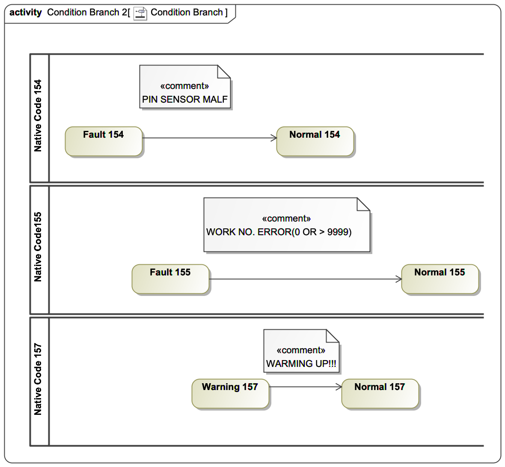

### Conditions {#sec:mapping-conditions}

In {{cite(MTCPart2)}}, the {{mtmodel(DataItem)}} represents the metadata describing the semantic meaning of the {{term(MTCondition)}} as it relates to its component using an object instance of type {{mtuatype(MTConditionType)}}. The activation and state of {{termplural(MTCondition)}} is represented by the {{mtuatype(MTConditionEventType)}} that is a subtype of the {{uamodel(BaseConditionType)}}. The MTConnect {{termplural(MTCondition)}} in {{cite(MTCPart3)}} is a representation of the state of various alarms and health of a {{term(MTComponent)}} of the machine. There are three states for a condition in MTConnect, they are {{mtmodel(Normal)}}, {{mtmodel(Warning)}}, and {{mtmodel(Fault)}} and have the semantic meaning *operating normally*, *a situation has been observed, but may self-correct*, and *a failure has occured and needs manual intervention* respectively. More information can be found in MTConnect {{cite(MTCPart2)}} and {{cite(MTCPart3)}} of the MTConnect Standard for Condition modeling and behavior.

When a {{term(MTCondition)}} becomes active in MTConnect, it will transition from {{mtmodel(Normal)}} to {{mtmodel(Warning)}} or {{mtmodel(Fault)}} state. The transition will cause an {{uamodel(Event)}} to be dispatched of the {{mtuatype(MTConditionEventType)}}. The {{mtuatype(MTConditionEventType)}} has a {{term(Property)}} called {{uamodel(ActiveState)}} that indicates that it is currently active. The {{uamodel(ActiveState)}} is an OPC UA {{uamodel(TwoStateVariableType)}} {{uamodel(Variable)}} defined in {{cite(UAPart8)}}. When a Condition is {{mtmodel(Normal)}}, the {{uamodel(ActiveState)}} is {{uamodel(False)}}, otherwise when either a {{mtmodel(Warning)}} or {{mtmodel(Fault)}} is present, the {{uamodel(ActiveState)}} is {{uamodel(True)}}. An active {{term(MTCondition)}} will require the {{uamodel(Retain)}} flag of the {{latex(\mtuamodel{MTConditionEventType})}} instance to be {{uamodel(True)}}.

~~~~xml
<ComponentStream componentId="zf476090" component="Rotary" name="C" nativeName="S">
  <Condition>
    <Normal sequence="201" timestamp="2018-10-31T20:34:19.9981Z" dataItemId="afb596b0" type="AMPERAGE" compositionId="b7792870" name="Soverload"/> | {#line:amp-201}|
    <Warning sequence="503" timestamp="2018-10-31T20:45:19.9981Z" dataItemId="afb596b0" type="AMPERAGE" compositionId="b7792870" name="Soverload" qualifier="HIGH" nativeCode="MOT-WARN">Spindle Motor Warning</Warning> | {#line:amp-503}|
    <Fault sequence="652" timestamp="2018-10-31T20:49:19.9981Z" dataItemId="afb596b0" type="AMPERAGE" compositionId="b7792870" name="Soverload" qualifier="HIGH" nativeCode="MOT-OVR">Spindle Motor Overload</Fault> | {#line:amp-652}|
  </Condition>
  ...
~~~~
{: caption="Rotary C Component Stream" label="rotary-component-stream" start="last" escape="|" }

Each time an MTConnect {{term(MTCondition)}} activates or deactivates, a {{term(Condition)}} {{term(Event)}} will be reported associated with the meta-data instance of the {{mtuatype(MTConditionType)}} using the {{term(NodeId)}} as the {{uamodel(SourceNode)}} of the {{uamodel(Event)}}.  {{mtuatype(MTConditionEventType)}} is a subtype of the {{term(Event)}} and MUST never be instantiated in the address space as an {{term(Object)}}.

#### Mapping Conditions

MTConnect allows {{mtmodel(Conditions)}} to represent multiple instances simultaneous {{mtblock(Faults)}} and {{mtblock(Warnings)}} associated with a {{mtmodel(Component)}} and of a particular {{mtblock(Type)}}. In MTConnect a {{mtblock(Type)}} can be something like a {{mtmodel(TEMPERATURE)}} or a {{mtmodel(LOGICAL_PROGRAM)}}. The {{mtmodel(Conditions)}} {{mtblock(Faults)}} and {{mtblock(Warnings)}} are associated by their unique characteristics of their description or more commonly their {{mtmodel(nativeCode)}}.

Every time a condition is reported as a separate instance, as described in {{cite(MTCPart3)}}, it is considered another activation of the {{mtblock(Condition)}} and will be associated with a unique {{uamodel(ConditionId)}} as the specific {{term(NodeId)}} of the {{mtuatype(MTConditionEventType)}}. The {{uamodel(ConditionName)}} is handled in the same manner as the {{uamodel(ConditionId)}} and must be unique for a stream of associated {{mtblock(Condition)}} set of states. Only when a {{mtmodel(Normal)}} with no {{latex(\xml{nativeCode})}} cleared all active Conditions, or each are cleared separately (going back to a {{mtmodel(Normal)}} state), does the condition report {{mtmodel(Normal)}} for a {{mtmodel(current)}} request. When all active {{mtblock(Condition)}}s are reported as {{mtmodel(Normal)}}, an {{mtuatype(MTConditionEventType)}} for each active {{mtblock(Condition)}} must be reported with the {{mtmodel(ActiveState)}} set to {{uamodel(False)}} and the {{uamodel(Retain)}} set to {{uamodel(False)}}.

The {{term(ConditionType)}} and {{uamodel(EventType)}} properties will be set as follows:

| Property | Type | Mapping |
|----------|------|---------|
| (Attribute) NodeId | NodeId | A {{uamodel(NodeId)}} associated with the MTConnect {{mtblock(Condition)}} stream. Often given by the {{mtmodel(nativeCode)}} attribute. Referred to as the {{uamodel(ConditionId)}} |
| EventId | ByteString | Auto-generated by the server per {{cite(UAPart5)}} |
| EventType | NodeId | The {{uamodel(NodeId)}} of the {{mtuatype(MTConditionEventType)}}. |
| SourceNode | NodeId | The {{uamodel(NodeId)}} of the {{uablock(Instance)}} of the {{mtuatype(MTConditionType)}} {{uablock(Object)}}
| representing the {{mtmodel(DataItem)}} with {{mtmodel(category)}} {{mtmodel(CONDITION)}}. |
| SourceName | NodeId | The {{uamodel(BrowseName)}} of the {{uamodel(SourceNode)}} referenced above. |
| Time | UtcTime | From MTConnect timestamp attribute. |
| ReceiveTime | UtcTime | Current time when MTConnect Condition received by OPC UA Server. |
| LocalTime | TimeZoneDataType | Optionally supplied by OPC UA Server since MTConnect uses UTC. |
| Message | LocalizedText | MTConnect Condition `CDATA`. |
| Severity | UInt16 | Taking the value for the {{mtblock(QName)}} of the {{mtmodel(Condition)}}:  {{markdown(*  When `Normal`, `Severity` is 0.   *  When `Warning`, `Severity` is 500.    *  When `Fault`, `Severity` is 1000.   {:.tight})}} |
| ConditionClassId | NodeId | The {{uamodel(NodeId)}} for the {{mtmodel(ClassType)}} representing the {{mtmodel(type)}} attribute of the {{mtmodel(DataItem)}}. |
| ConditionClassName | LocalizedText | The name associated with the {{uamodel(ConditionClassId)}}. |
| ConditionSubClassId | NodeId | The {{uamodel(NodeId)}} for the {{mtmodel(ClassType)}} representing the {{mtmodel(subType)}} attribute of the {{mtmodel(DataItem)}}. |
| ConditionSubClassName | LocalizedText | The name associated with the {{uamodel(ConditionSubClassId)}}. |
| ConditionName | String | A text version of the set of associated conditions, should follow the same rules as the {{uamodel(ConditionId)}}. For example, the name MAY be composed of the {{mtmodel(SourceName)}} and the {{mtmodel(nativeCode)}}. |
| BranchId | NodeId | Not used for MTConnect. |
| Retain | Boolean | Taking the value for the {{mtblock(QName)}} of the {{mtmodel(Condition)}}: {{markdown(*  When only `Normal`, `False`   *  When `Warning` or `Fault`, `True`   {:.tight})}} |
| EnabledState | LocalizedText | Taking the value for the {{mtblock(QName)}} of the {{mtmodel(Condition)}}: {{markdown(*  When `Unavailable`, `Disabled`   *  Otherwise, `Enabled`   {:.tight})}} |
| Quality | StausCode | Taking the value for the {{mtblock(QName)}} of the {{mtmodel(Condition)}}: {{markdown(*  When `Unavailable`, `Bad_NotConnected`   *  Otherwise, `Good`   {:.tight})}} |
| LastSeverity | Uint16 | Set to the previous severity for this condition. |
| Comment | LocalizedText | Set to the {{mtblock(CDATA)}} of the Condition. |
| ClientUserId | String | The {{mtmodel(name)}} of the {{mtmodel(Device)}}. |
| ActiveState | LocalizedText | Taking the value for the {{mtblock(QName)}} of the {{mtmodel(Condition)}}: {{markdown(*  When only `Normal`, `Inactive`   *  When `Warning` or `Fault`, `Active`   {:.tight})}} |
{: caption="Mapping to `MTConditionEventType` Properties" label="ua-condition-event-mapping" format-1="p 2in" format-2="p 1in" format-3="p 3in" }

{{latex(\FloatBarrier)}}

#### MTConnect Condition Parallel Activation

As stated above, MTConnect allows for multiple {{mtmodel(Condition)}}s of the same type to be active at the same time. In MTConnect the conditions are differentiated by their {{mtmodel(nativeCode)}} or {{term(CDATA)}}. In the following example, the attribute {{mtmodel(nativeCode)}} is used to indicate the independent activations of the {{mtmodel(Condition)}}. In this diagram, there are three activations--0, 1, and 2--of the PLC alarms and are associated with the {{mtmodel(LOGIC_PROGRAM)}}. Each of the unique {{mtmodel(nativeCode)}}s is mapped to an {{uamodel(Event)}} and tracked separately. 

The {{mtmodel(Condition)}} is instantiated in the {{uamodel(AddressSpace)}} as an {{mtuatype(MTConditionType)}} and acts as the source of the {{uamodel(Event)}}s when they are sent. The individual activation and deactivations are tracked using the {{uamodel(Event)}} mechanism as described in {{cite(UAPart3)}} and {{cite(UAPart4)}}. All {{uamodel(Event)}}s will have the same {{uamodel(SourceNode)}} since they are all produced from the same {{mtuatype(MTConditionType)}} instance.

Table&#160;{{table(ua-condition-states)}} represents the state transitions of the key OPC UA {{uamodel(Condition)}} model and the reporting of {{mtuatype(MTConditionEventType)}}. The text that follows will refer to this table and the MTConnect {{term(xml)}} to illustrate the expected behavior. Figure&#160;{{figure(condition-branching)}} gives a visual representation of the event reporting.

| Seq  | Active | Retain | Native Code | Message |
|-----:|--------|--------|-------------|---------|
| 1    | false  | false  |  NULL       | NULL    |
| 2    | true   | true   | PLC--154    | PIN SENSOR MALF |
| 3    | true   | true   | PLC--155    | WORK NO. ERROR(0 OR >9999) |
| 4    | true   | true   | PLC--157    | WARMING UP!!! |
| 5    | false  | false  | PLC--154    | PIN SENSOR MALF |
| 6    | false  | false  | PLC--157    | WARMING UP!!! |
| 7    | false  | false  | PLC--155    | WORK NO. ERROR(0 OR >9999) |
| 8    | false  | false  | NULL        | NULL |
{: caption="`LogicProgramCondition` States" label="ua-condition-states" format-1="p 0.25in"}

{{latex(\FloatBarrier)}}

For this example, MTConnect uses the {{mtmodel(nativeCode)}} to determine the uniqueness of each activation of the Condition. If the {{mtblock(Path)}} component has a {{term(MTDataItem)}} with a {{term(type)}} of {{mtmodel(LOGIC_PROGRAM)}} as given in listing&#160;{{ref(lst:controller-component)}}, the {{term(MTDataItem)}} will be represented in the OPC UA model as a instance of the {{mtuatype(MTConditionType)}} with the attributes presented as properties.

The initial state of the system is given in Table&#160;{{table(ua-condition-states)}} Row&#160;1. When the condition is inactive, the {{uamodel(AciveState)}} property is {{uamodel(false)}} and the {{uamodel(Retain)}} flag is also set to {{uamodel(false)}}. This corresponds to Listing&#160;{{ref(lst:path-logic-program-condition-0)}} and the {{mtmodel(Normal)}} initial condition state with no {{mtmodel(nativeCode)}} indicating there are no active conditions.

~~~~xml
<Normal sequence="5200" timestamp="2018-10-31T20:30:19.9981Z" dataItemId="a557d330" type="LOGIC_PROGRAM"/>
~~~~
{: caption="Path Logic Program Initial Normal State" label="path-logic-program-condition-0"

The first fault occurred with the {{mtmodel(nativeCode)}} {{mtmodel(PLC-154)}} and reports an {{uamodel(Event)}} {{mtuatype(MTConditionEventType)}} as shown in Listing&#160;{{ref(lst:path-logic-program-condition-1)}}. A {{mtmodel(Fault)}} indicates a situation where the piece of equipment is no longer able to continue functioning and needs manual intervention.

~~~~xml
  <ComponentStream componentId="a4a7bdf0" component="Path" name="P1">
    <Condition>
      <Fault sequence="5201" timestamp="2018-10-31T20:34:19.9981Z" dataItemId="a557d330" type="LOGIC_PROGRAM" nativeCode="PLC-154">PIN SENSOR MALF</Fault>
    </Condition>
  </ComponentStream>
~~~~
{: caption="Path Logic Program First Fault PLC-154" label="path-logic-program-condition-1" start="last" }

The second {{mtmodel(Fault)}} is given in Listing&#160;{{ref(lst:path-logic-program-condition-2)}} where a second PLC alarm is active. The native code is different than the previous condition, so a second {{mtuatype(MTConditionEventType)}} must be reported with a unique {{uamodel(ConditionId)}} indicated using the {{uamodel(NodeId)}} in the {{uamodel(Event)}}. 

~~~~xml
  <ComponentStream componentId="a4a7bdf0" component="Path" name="P1">
    <Condition>
      <Fault sequence="5209" timestamp="2018-10-31T20:36:19.9981Z" dataItemId="a557d330" type="LOGIC_PROGRAM" nativeCode="PLC-155">WORK NO. ERROR(0 OR >9999)</Fault>
    </Condition>
  </ComponentStream>
~~~~
{: caption="Path Logic Program Second Fault PLC-155" label="path-logic-program-condition-2" start="last" }

The warning in Listing&#160;{{ref(lst:path-logic-program-condition-3)}} indicates the machine is warming up and other operations are disabled. This condition has another {{mtmodel(nativeCode)}} and therefore, like the previous condition, another {{uamodel(Event)}} must be reported. The {{mtmodel(Warning)}} will be represented in UA as a {{uamodel(severity)}} and represents something that is of concern but not stopping the process. The warning is given by Row&#160;4 of Table&#160;{{table(ua-condition-states)}}.

~~~~xml
  <ComponentStream componentId="a4a7bdf0" component="Path" name="P1">
    <Condition>
      <Warning sequence="5318" timestamp="2018-10-31T20:42:19.9981Z" dataItemId="a557d330" type="LOGIC_PROGRAM" nativeCode="PLC-157">WARMING UP!!!</Warning>
    </Condition>
  </ComponentStream>
~~~~
{:caption="Path Logic Program Warning PLC-157" label="path-logic-program-condition-3" start="last" }

In Listing&#160;{{ref(lst:path-logic-program-condition-4)}}, when the sensor malfunction is reset, the first condition will be returned to an inactive state. This is indicated by {{mtmodel(Normal)}} and a native code of {{mtmodel(PLC-154)}}. Since the other two conditions are still active, a {{mtmodel(current)}} request would indicate that there is a Fault and a Warning currently active for this {{mtmodel(Condition)}}. The clearing of this individual {{mtmodel(Fault)}} is also represented on Row&#160;5 of Table&#160;{{table(ua-condition-states)}}. An {{mtuatype(MTConditionEventType)}} {{uamodel(Event)}} will be reported with its {{mtmodel(ActiveState)}} set to {{uamodel(False)}} and {{uamodel(Retain)}} property set to {{uamodel(False)}}.

~~~~xml
  <ComponentStream componentId="a4a7bdf0" component="Path" name="P1">
    <Condition>
      <Normal sequence="5467" timestamp="2018-10-31T20:51:19.9981Z" dataItemId="a557d330" type="LOGIC_PROGRAM" nativeCode="PLC-154"/>
    </Condition>
  </ComponentStream>
~~~~
{: caption="Path Logic Program Clear Fault of PLC-154" label="path-logic-program-condition-4" start=last" }

In Listing&#160;{{ref(lst:path-logic-program-condition-5)}}, when the machine finishes warming up, the first condition will be returned to an inactive state. It is indicated by {{mtmodel(Normal)}} and a native code of {{mtmodel(PLC-157)}} and will be handled like the previous case. In MTConnect, a {{mtmodel(current)}} request would indicate that there is a Fault and a Warning currently active for this {{mtmodel(Condition)}}. Similar to the previous state, Table&#160;{{table(ua-condition-states)}} clears the active state of this {{uamodel(Event)}} on Row&#160;6.

~~~~xml
  <ComponentStream componentId="a4a7bdf0" component="Path" name="P1">
    <Condition>
      <Normal sequence="5467" timestamp="2018-10-31T20:52:19.9981Z" dataItemId="a557d330" type="LOGIC_PROGRAM" nativeCode="PLC-157"/>
    </Condition>
  </ComponentStream>
~~~~
{: caption="Path Logic Program Clear Warning PLC-157" label="path-logic-program-condition-5" start="last" }

Listing&#160;{{ref(lst:path-logic-program-condition-6)}} represents the final {{mtmodel(Normal)}} transition that clears all the currently active conditions and indicates that all the {{mtmodel(Conditions)}} are now inactive or cleared and back to a {{mtmodel(Normal)}} state. Row&#160;7 of Table&#160;{{table(ua-condition-states)}} shows the clearing of the final activation and then we clear everything in Row&#160;8.

~~~~xml
  <ComponentStream componentId="a4a7bdf0" component="Path" name="P1">
    <Condition>
      <Normal sequence="5467" timestamp="2018-10-31T20:57:19.9981Z" dataItemId="a557d330" type="LOGIC_PROGRAM"/>
    </Condition>
  </ComponentStream>
~~~~
{: caption="Path Logic Program Back to Normal, All Clear" label="path-logic-program-condition-6" start="last" }

